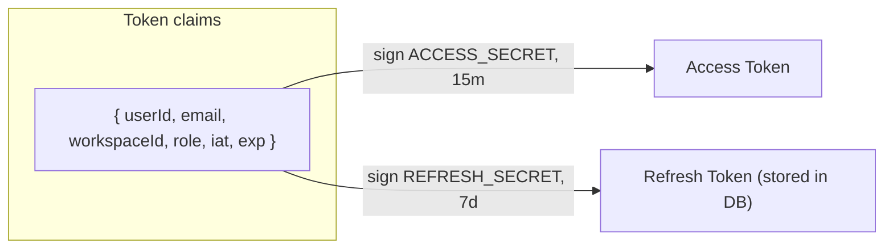
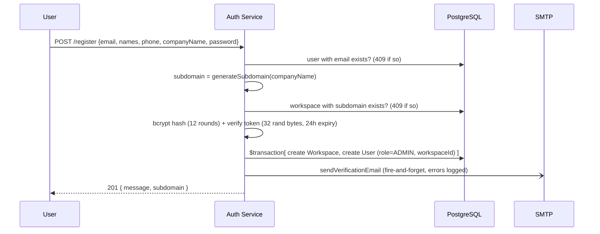
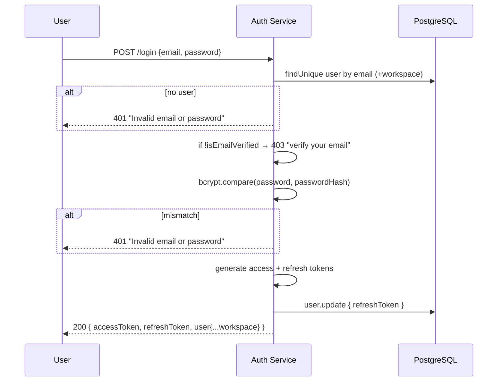
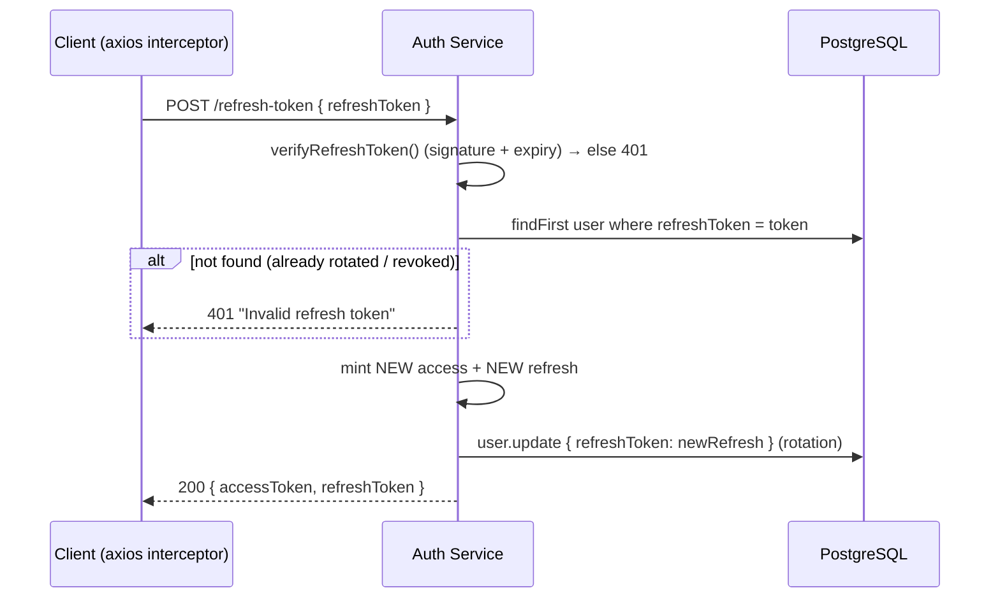
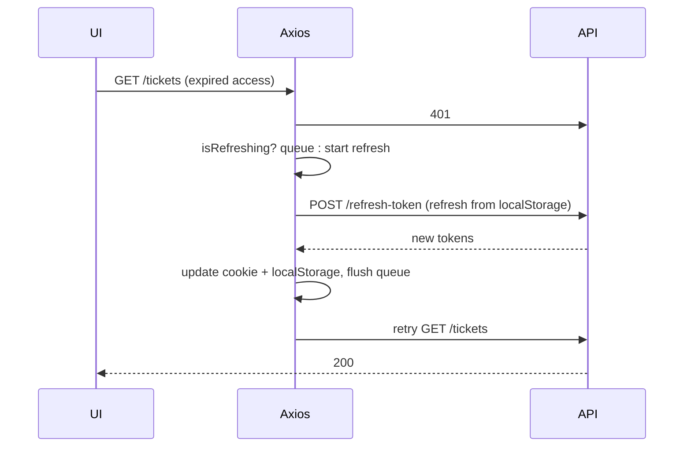

# Authentication Architecture

Modules: `apps/api/src/modules/auth/*`, `utils/jwt.ts`, `utils/password.ts`, `utils/token.ts`,
`middlewares/auth.middleware.ts`. Frontend: `apps/web/src/lib/{api,token,auth-context}.ts`.

## 1. Overview

SupportHub uses **stateless dual‑token JWT auth** with **DB‑backed refresh‑token rotation**:

- **Access token** — short‑lived (default **15m**), signed with `JWT_ACCESS_SECRET`, sent as
  `Authorization: Bearer` on every request and on the Socket.IO handshake.
- **Refresh token** — long‑lived (default **7d**), signed with a *separate* `JWT_REFRESH_SECRET`,
  **persisted on `User.refreshToken`**, and **rotated** on every use (old one invalidated).

Both tokens carry the same payload: `{ userId, email, workspaceId, role }`. `workspaceId` is the
critical tenant claim — it makes every authenticated request tenant‑aware without a DB lookup.

## 2. Registration & Onboarding

`POST /api/v1/auth/register` (public) — `auth.service.ts:registerUser`.

Key points:
- **Atomic workspace + admin user** via `prisma.$transaction` — no orphan workspace if user insert fails.
- The **first user is `ADMIN`** (schema default `role @default(ADMIN)`); all later users join via
  invitation as `AGENT`.
- **Subdomain** is derived from company name (`generateSubdomain`: lowercase, strip non‑alphanumeric,
  ≤63 chars) and must be globally unique.
- Verification email is **fire‑and‑forget** — registration succeeds even if SMTP is down (token still
  stored, user can resend).

### Email verification

`GET /api/v1/auth/verify-email?token=…` → looks up `emailVerifyToken` (unique), checks
`emailVerifyExpires` (24h), sets `isEmailVerified=true`, **nulls the token** (single‑use), then
**302‑redirects** to `https://{subdomain}.{FRONTEND_DOMAIN}/login?verified=true`.

`POST /api/v1/auth/resend-verification` — anti‑abuse:
- Returns a **generic message** whether or not the email exists (enumeration‑safe).
- **Rate limited**: if existing token expiry is >23h away (i.e. last send <1h ago) → `429`.
- **Email‑first**: SMTP send must succeed *before* the new token is persisted.

## 3. Login

`POST /api/v1/auth/login` — `auth.service.ts:loginUser`.

Security details:
- **Generic error** for both "no user" and "bad password" → no email enumeration.
- **Email‑verified gate** returns `403` (distinct from `401`) so the UI can prompt "resend
  verification".
- bcrypt `compare` is timing‑safe; `SALT_ROUNDS = 12`.
- The freshly issued refresh token overwrites `User.refreshToken` → **one active session token per user**.

## 4. Refresh‑Token Rotation

`POST /api/v1/auth/refresh-token` — two‑stage validation:

Why this is meaningful:
- The refresh token must both **verify cryptographically** *and* **match the value stored in the DB**.
- On every refresh the stored value is replaced, so a **stolen older refresh token stops working** the
  moment the legitimate client refreshes (basic rotation / reuse detection foundation).
- **Logout / password reset** sets `refreshToken: null`, instantly invalidating the session.
  Reset‑password additionally nulls it to "invalidate all sessions".

> Trade‑off: a single `refreshToken` column means **one device/session at a time** per user — logging
> in on a second device silently invalidates the first. A `Session` table (token → device) would be the
> upgrade for multi‑device.

## 5. Password Reset

`POST /forgot-password` → generic response (enumeration‑safe), generate 32‑byte token,
**1‑hour** expiry, **email‑first** then persist `passwordResetToken/Expires`.

`POST /reset-password` → validate token + expiry, enforce **strong password regex** (upper+lower+
digit+special), bcrypt‑hash, then atomically set new hash, null the reset token, **and null
`refreshToken`** (kills all sessions).

## 6. Session Management on the Frontend

From `apps/web/src/lib/`:

| Token | Stored in | Reason |
|-------|-----------|--------|
| Access | **Cookie** (`js-cookie`, `SameSite=Lax`, `Secure` on HTTPS, 1‑day) | readable by middleware/SSR + attached to requests |
| Refresh | **localStorage** | client‑only, survives reloads |

- **Axios request interceptor** attaches `Authorization: Bearer <access>`.
- **Axios response interceptor** handles `401`: it calls `/auth/refresh-token`, and uses a
  `failedQueue` + `isRefreshing` flag so **concurrent 401s trigger only one refresh** and then replay.
  On refresh failure it dispatches a `auth:logout` window event.
- **`AuthContext`** hydrates the user via `GET /auth/me` on mount, exposes `login/logout/refreshUser`,
  and listens for `auth:logout` to hard‑redirect to `/login`.

## 7. Security Mechanisms Summary

| Mechanism | Implementation |
|-----------|----------------|
| Password storage | bcrypt, 12 rounds |
| OAuth token storage | AES‑256‑GCM (`utils/encryption.ts`), key from `ENCRYPTION_KEY` |
| Token separation | distinct secrets for access vs refresh |
| Rotation | refresh token replaced + DB‑checked each use |
| Enumeration resistance | generic messages on login / forgot / resend |
| Single‑use tokens | verify/reset tokens nulled after use; `@unique` columns |
| Rate limiting | resend‑verification 1/hour (token‑expiry heuristic) |
| Tenant binding | `workspaceId` is a signed claim, validated by middleware + socket |
| Request tracing | `requestId` in every log + error response |

## 8. Weaknesses / Notes (for interview honesty)

- **Default dev secrets** (`"access-secret-dev"` etc.) — must be overridden in prod; no startup guard
  that fails fast if unset.
- **No global rate limiting** on `/login` (brute‑force) — only resend‑verification is throttled.
- **No account lockout** after repeated failed logins.
- **Single refresh token** = no multi‑device sessions and no per‑device revocation.
- **Access token has no server‑side revocation** (stateless) — a leaked access token is valid until
  its 15‑minute expiry.
- **Reset enforces strong passwords but registration does not** (`min(8)` only) — inconsistent policy.
</content>
