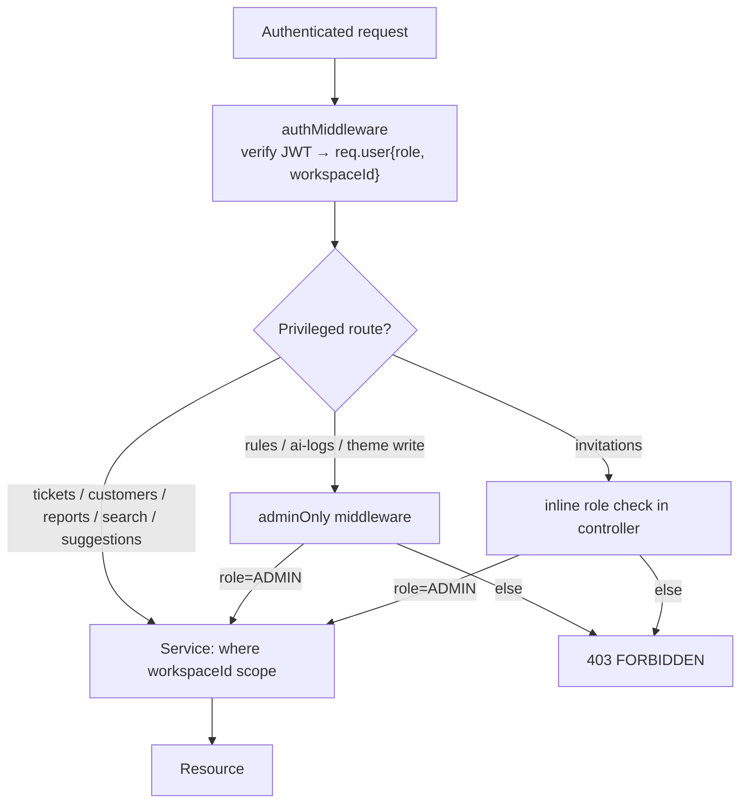

# Authorization / RBAC Architecture

## 1. Overview

SupportHub uses a **two‑role RBAC** model scoped to a workspace, layered on top of the tenant
isolation. Authorization answers two orthogonal questions on every request:

1. **Tenant**: *which* workspace's data may you touch? → enforced by `workspaceId` from the JWT
   (see [multi-tenant-architecture.md](./multi-tenant-architecture.md)).
2. **Role**: *what* may you do within that workspace? → `Role` enum `ADMIN | AGENT`.

```
User
 └─ belongs to exactly one Workspace (tenant)
     └─ has a Role (ADMIN | AGENT)        ← from User.role, embedded in JWT
         └─ Role gates privileged endpoints (adminOnly middleware / inline checks)
             └─ Tenant scope gates which rows (where workspaceId)
                 └─ Resource Access
```

## 2. Roles & Permissions

| Capability | ADMIN | AGENT | Enforced where |
|------------|:-----:|:-----:|----------------|
| Register workspace (becomes first admin) | ✅ (creator) | — | `register` sets `role=ADMIN` default |
| Invite agents / list invites / list team | ✅ | ❌ | inline `user.role !== "ADMIN"` checks in `invitation.controller` |
| Accept invitation (becomes AGENT) | — | ✅ | `acceptInvitation` hard‑codes `role=AGENT` |
| View/create/update tickets, add comments | ✅ | ✅ | `authMiddleware` only |
| View customers | ✅ | ✅ | `authMiddleware` only |
| Manage **assignment rules** (CRUD/reorder/toggle) | ✅ | ❌ | `rules.routes` → `router.use(adminOnly)` |
| View **AI decision logs** | ✅ | ❌ | `ai-logs.routes` → `router.use(adminOnly)` |
| Review **tag suggestions** (accept/reject) | ✅ | ✅ | `authMiddleware` only |
| Update **workspace theme** / upload logo/favicon | ✅ | ❌ | `workspace.routes` → `adminOnly` per route |
| Read workspace theme | ✅ | ✅ | `authMiddleware` only |
| Reports / analytics | ✅ | ✅ | `authMiddleware` only |
| Search | ✅ | ✅ | `authMiddleware` only |

There is **no AGENT‑level resource ownership check** — e.g. an AGENT can view/update *any* ticket in
the workspace, not only tickets assigned to them. Authorization granularity stops at role + tenant.

## 3. Enforcement Points

Two enforcement mechanisms exist:

### (a) `adminOnly` middleware — `middlewares/admin.middleware.ts`

```ts
if (!user || user.role !== "ADMIN") throw AppError.forbidden("Only admins can perform this action");
```
Applied either router‑wide (`rules`, `ai-logs`) or per‑route (`workspace` theme mutations). Always
chained **after** `authMiddleware` (which populates `req.user`).

### (b) Inline controller checks

The **invitation module** doesn't use `adminOnly`; instead each controller method re‑checks
`authReq.user?.role !== "ADMIN"` and throws `AppError.forbidden`. Functionally equivalent, but
inconsistent style (worth flagging — see weaknesses).



## 4. Authorization Flow (resource‑level)

For read/update/delete of a single record the services apply **defense‑in‑depth**: fetch by id, then
compare `record.workspaceId === req.user.workspaceId`, returning `404 NOT_FOUND` (not 403) on mismatch
— this avoids leaking the existence of another tenant's record.

```ts
const ticket = await prisma.ticket.findUnique({ where: { id } });
if (!ticket || ticket.workspaceId !== workspaceId) throw AppError.notFound("Ticket not found");
```

## 5. Socket‑level Authorization

The Socket.IO handshake runs the same JWT verification and **auto‑joins `workspace:{workspaceId}`**.
Events are only emitted to that room, so a socket can never receive another tenant's events. Role is
present on `socket.data.user` but **not currently used** to gate socket events (all roles in a
workspace receive all ticket events).

## 6. Weaknesses & Improvements

| Weakness | Impact | Suggested improvement |
|----------|--------|-----------------------|
| Only 2 roles, no granular permissions | Can't express "billing agent", read‑only viewer, supervisor | Introduce a `Permission` set or policy table; or attribute‑based checks |
| AGENT can act on **any** ticket | No "my tickets only" restriction | Add ownership predicate (`assigneeId = userId`) for AGENT scope where appropriate |
| Mixed enforcement (middleware vs inline) | Easy to forget a check on a new endpoint | Standardize on `adminOnly` (or a `requireRole(...)` factory) everywhere |
| No audit of **who** changed a ticket/role | Compliance gap | Add an audit log for mutations (actor, before/after) |
| Role is a static JWT claim | A demotion takes effect only after token refresh (≤15m) | Acceptable given short access TTL; document it |
| Socket events not role‑filtered | Internal notes/events visible to all roles | Filter sensitive events by role if needed |
</content>
