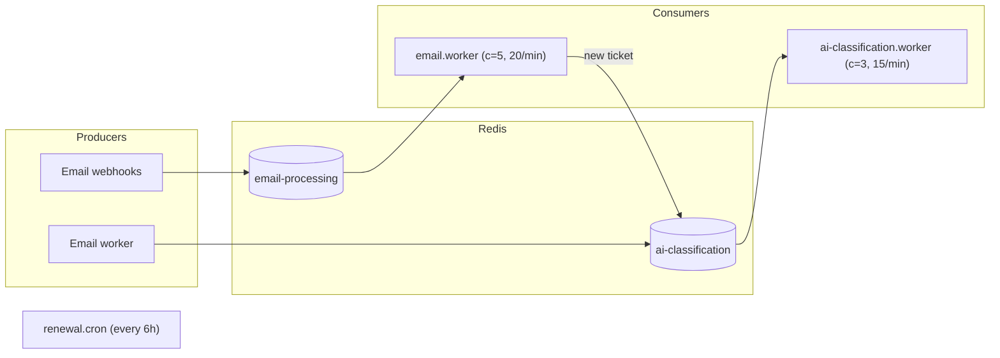
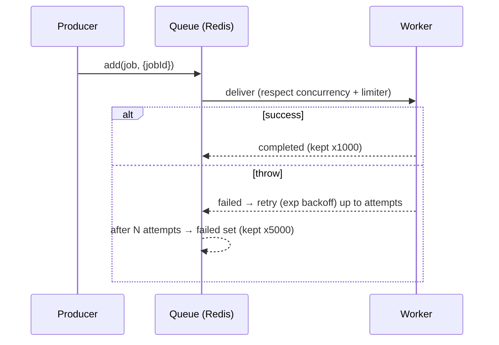
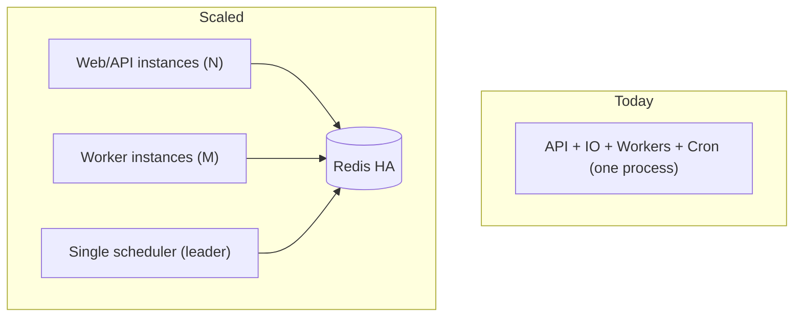

# Background Job Architecture

Source: `lib/queue.ts`, `lib/redis.ts`, `workers/email.worker.ts`,
`workers/ai-classification.worker.ts`, `cron/renewal.cron.ts`.

## 1. Overview

SupportHub runs an **async work plane on BullMQ (Redis‑backed)** plus a **node‑cron scheduler**, all
inside the same Node process as the API (started in `index.ts`: `startEmailWorker()`,
`startAIClassificationWorker()`, `startRenewalCron()`).

Why background jobs exist:
- Webhooks must ACK in <1s → real work is enqueued, not done inline.
- Gemini calls are slow/rate‑limited → isolated on their own queue.
- Provider watches/subscriptions expire → must be renewed on a timer.

## 2. Redis Connection

`lib/redis.ts` — single `ioredis` instance from `REDIS_URL`, with `maxRetriesPerRequest: null` and
`enableReadyCheck: false` (both **required by BullMQ**). Throws at boot if `REDIS_URL` is unset.
Auto‑reconnects; connection errors are logged. Locally Redis runs via `docker-compose.yml`
(`redis:7-alpine`, AOF persistence).

## 3. Queue: `email-processing`

| Property | Value |
|----------|-------|
| Job name | `process-email` |
| Producer | `enqueueEmailJob()` from webhook controllers |
| Consumer | `email.worker.ts` |
| Payload | `{ provider, accountEmail, historyId?, messageId?, workspaceId }` |
| Concurrency | 5 |
| Rate limit | 20 jobs / 60s |
| Retries | 3 attempts, exponential backoff **5s → 10s → 20s** |
| Retention | keep last 1000 completed, 5000 failed |
| Idempotency | `jobId = `\``${provider}-${accountEmail}-${historyId||messageId}`\` |

**Consumer logic:** route by provider → fetch fresh tokens → fetch message(s) → `processInboundEmail`.
On exception the job throws (→ retry). Individual message failures are caught and skipped so a batch
isn't lost.

## 4. Queue: `ai-classification`

| Property | Value |
|----------|-------|
| Job name | `classify-ticket` |
| Producer | `enqueueAIClassificationJob()` from `email-processor` (after ticket create) |
| Consumer | `ai-classification.worker.ts` |
| Payload | `{ emailAccountId, ticketId, subject, bodyPlain, workspaceId }` |
| Concurrency | 3 |
| Rate limit | 15 jobs / 60s |
| Retries | 3 attempts, exponential backoff **3s → 6s → 12s** |
| Retention | keep last 1000 completed, 5000 failed |
| Idempotency | `jobId = classify-{ticketId}` |

**Consumer logic:** Gemini classify → apply/suggest tags → set priority → run assignment engine →
write `AIDecisionLog` → emit socket events. A **Gemini failure returns `null` and is *not* retried**
(it's a valid "untagged" outcome, still logged); a **DB error throws and *is* retried**.

## 5. Why two queues?

Documented intent (`lib/queue.ts`): keep **email ingestion** isolated from **Gemini latency**, and give
each independent retry/rate‑limit tuning. Ingestion is fast and bursty (20/min, short backoff); AI is
slow and externally rate‑limited (15/min, even shorter backoff to recover fast from transient API
errors). Failure in one never stalls the other.

## 6. Scheduler: `renewal.cron.ts`

`node-cron`, schedule `0 */6 * * *` (every 6 hours). Three responsibilities each run:

| Task | Trigger window | Action |
|------|----------------|--------|
| Gmail watch renewal | `watchExpiry < now+48h` | re‑`users.watch`, update `watchExpiry` + `historyId` |
| Outlook subscription renewal | `watchExpiry < now+12h` | `PATCH /subscriptions/{id}` extend +2 days |
| OAuth token refresh | `tokenExpiresAt < now+10m` | refresh, re‑encrypt, persist |

Each loops `EmailAccount`s with try/catch per account so one failure doesn't abort the sweep.

## 7. Failure Handling & "Dead Letter"

- **Retries**: BullMQ exponential backoff per queue (above).
- **Failed retention**: failed jobs are kept (`removeOnFail: {count: 5000}`) — this is the de‑facto
  **dead‑letter store** for inspection; there is **no separate DLQ queue and no automatic
  re‑drive/alerting**.
- **Idempotent jobIds + DB unique constraints** make retries safe (re‑processing the same email is a
  no‑op via `EmailMessage` uniqueness; re‑classifying is bounded by `classify-{ticketId}`).
- **No BullMQ dashboard** (e.g. Bull Board) wired in; failures are observed via logs.

## 8. Scaling & Risks

| Concern | Detail | Recommendation |
|---------|--------|----------------|
| **Workers run in the API process** | A traffic spike on HTTP competes with job processing for the same event loop; a crash takes both down | Split workers into their own process/deployment (same codebase, different entrypoint) |
| **Single Redis** | SPOF for the entire async plane | Redis HA (Sentinel/Cluster) or managed Redis |
| **Cron is in‑process & not distributed** | Running 2+ API instances ⇒ the cron fires on **each**, duplicating renewals | Move to a single scheduler, a leader‑election lock, or BullMQ **repeatable jobs** (dedup via jobId) |
| **No alerting on failed jobs** | Silent failures accumulate in the failed set | Add Bull Board + alerts on failed‑count thresholds |
| **Rate limits are global, not per‑tenant** | One noisy tenant can consume the 20/min or 15/min budget | Per‑workspace queues or BullMQ groups/priorities |
| **Gemini quota** | 15/min cap is conservative but global | Per‑tenant quotas; batch classification |

</content>
