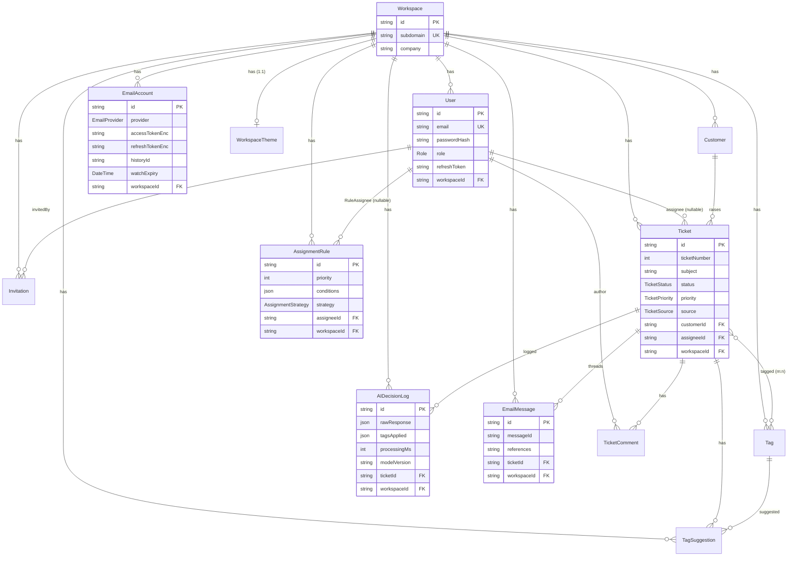
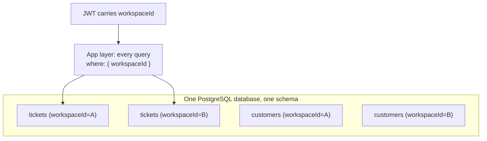

# Database Architecture

Source of truth: `apps/api/prisma/schema.prisma` (PostgreSQL via `@prisma/adapter-pg`, Prisma 7).

## 1. Overview

- **Engine:** PostgreSQL. Client is a Prisma singleton (`lib/prisma.ts`) built on the **`PrismaPg`
  driver adapter** with a connection string from `DATABASE_URL`.
- **Primary keys:** UUID (`@default(uuid())`) everywhere — chosen explicitly "for multi‑tenant safety"
  (schema comment, `User.id`). UUIDs avoid cross‑tenant ID guessing and make merges/sharding easier.
- **Tenancy column:** almost every table carries `workspaceId` (FK → `Workspace`). This is the spine of
  the multi‑tenant design (shared DB, shared schema).
- **11 models, 8 enums.**

## 2. Entities

| Model | Purpose | Owns `workspaceId`? |
|-------|---------|:-------------------:|
| `Workspace` | The tenant. Created once per company registration. `subdomain` is the routing key. | n/a (is the tenant) |
| `User` | Internal team member (ADMIN or AGENT). Globally‑unique `email`. Holds auth state + current `refreshToken`. | ✅ |
| `Invitation` | Pending agent invite (token, expiry, status). | ✅ |
| `Customer` | External end‑user who raises tickets. Unique per `(email, workspaceId)`. | ✅ |
| `Ticket` | The support request. Per‑workspace `ticketNumber`. | ✅ |
| `TicketComment` | Public reply or internal note on a ticket, authored by a `User`. | ➖ (via Ticket) |
| `Tag` | Controlled‑vocabulary label in a `TagCategory`. Unique per `(name,category,workspaceId)`. | ✅ |
| `TagSuggestion` | AI suggestion below confidence threshold, pending agent review. | ✅ |
| `AssignmentRule` | Admin rule: JSON conditions → assignee/strategy + side‑effects. | ✅ |
| `AIDecisionLog` | Immutable audit of every Gemini classification + assignment decision. | ✅ |
| `EmailAccount` | Connected Gmail/Outlook account; encrypted OAuth tokens + watch state. Unique per `(provider,workspaceId)`. | ✅ |
| `EmailMessage` | Processed inbound email record; powers dedup + threading. Unique per `(messageId,workspaceId)`. | ✅ |
| `WorkspaceTheme` | 1‑to‑1 white‑label config (colors/font/radius/mode + logo/favicon URLs). | ✅ (unique) |

### Enums

`Role(ADMIN, AGENT)` · `InvitationStatus(PENDING, ACCEPTED, EXPIRED)` ·
`TicketStatus(OPEN, PENDING, SOLVED, CLOSED)` · `TicketPriority(LOW, MEDIUM, HIGH, URGENT)` ·
`TicketSource(MANUAL, EMAIL)` · `TagCategory(ISSUE_TYPE, DEPARTMENT, PRODUCT_AREA, SENTIMENT, SLA)` ·
`SuggestionStatus(PENDING, ACCEPTED, REJECTED)` · `AssignmentStrategy(SPECIFIC, ROUND_ROBIN)` ·
`EmailProvider(GMAIL, OUTLOOK)`.

## 3. ER Diagram

## 4. Key Relationships & Ownership Boundaries

- **Everything hangs off `Workspace`.** `Workspace` is the tenant aggregate root; deleting it would
  (conceptually) cascade the entire tenant. There are no DB‑level cascade rules defined in the schema —
  cascades are handled in application code where needed (e.g. `deleteTicket` deletes comments in a
  `$transaction` before the ticket).
- **User vs Customer split** is deliberate: `User` = internal staff (authenticates, has a role);
  `Customer` = external person (never logs in, only emails). Both are workspace‑scoped, but `User.email`
  is **globally unique** (login identity) while `Customer.email` is unique **only within a workspace**.
- **Ticket assignment** is nullable (`assigneeId String?`) → unassigned tickets are first‑class
  (the "unassigned" view filters `assigneeId = null`).
- **Tags are many‑to‑many** with Ticket (implicit Prisma join table). Tag application = `connect`;
  tag suggestions live in a separate `TagSuggestion` table until an agent accepts (which then
  `connect`s the tag).
- **Rules reference users** via a named relation `RuleAssignee` (so a User can be both a ticket assignee
  and a rule target without relation ambiguity).

## 5. Uniqueness & Integrity Constraints (the important ones)

| Constraint | Model | Why it matters |
|-----------|-------|----------------|
| `email` unique (global) | User | Single login identity across the platform |
| `subdomain` unique (global) | Workspace | Tenant routing key; collision = registration rejected |
| `@@unique([email, workspaceId])` | Customer | One customer record per email per tenant; enables upsert on inbound mail |
| `@@unique([ticketNumber, workspaceId])` | Ticket | Human‑friendly per‑tenant sequence (#1, #2 …) |
| `@@unique([messageId, workspaceId])` | EmailMessage | **Dedup guarantee** — same email can't create two tickets |
| `@@unique([provider, workspaceId])` | EmailAccount | One Gmail + one Outlook per workspace |
| `@@unique([name, category, workspaceId])` | Tag | No duplicate tags within a category per tenant |
| `@@unique([workspaceId, tagId, ticketId])` | TagSuggestion | One suggestion per (tag,ticket); enables `createMany skipDuplicates` |
| `@@unique([email, workspaceId])` | Invitation | One active invite per email per workspace (upsert‑friendly) |
| `workspaceId` unique | WorkspaceTheme | Enforces 1:1 with Workspace |
| `emailVerifyToken`, `passwordResetToken`, `refreshToken` unique | User | Single‑use token semantics |

## 6. Multi‑Tenancy Data Model

**Strategy: Shared database, shared schema, discriminator column (`workspaceId`).**

- **Isolation is enforced in the application layer, not the database.** There is no PostgreSQL
  Row‑Level Security (RLS) policy. Each service filters `where: { workspaceId }` and, for
  fetch‑by‑id paths, re‑verifies `record.workspaceId === req.user.workspaceId` (defense‑in‑depth — see
  `getTicket`, `updateTicket`, `deleteTicket`, `addComment`).
- **Tenant context source:** `workspaceId` is embedded in the JWT at login and cannot be set by the
  client. The auth middleware rejects tokens missing `workspaceId`.
- Full treatment in [multi-tenant-architecture.md](./multi-tenant-architecture.md).

## 7. Notable Design Details

- **Encrypted columns:** `EmailAccount.accessTokenEnc` / `refreshTokenEnc` store AES‑256‑GCM
  ciphertext (`iv:authTag:ciphertext` hex) — OAuth tokens are never at rest in plaintext.
- **JSON columns:** `AssignmentRule.conditions` (`{operator, conditions[]}`) and
  `AIDecisionLog.rawResponse/tagsApplied/tagsSuggested` use `Json` for schema‑flexible payloads. Trade‑off:
  can't index/filter inside them efficiently.
- **Watch/sync state on `EmailAccount`:** `historyId` (Gmail incremental cursor), `watchResourceId`
  (Gmail watch id / Outlook subscriptionId), `watchExpiry` (renewal trigger), `tokenExpiresAt`.
- **`WorkspaceTheme` created lazily** — defaults are returned by the API until the first theme write
  performs an `upsert`.

## 8. Indexing & Migrations

- Migrations live in `prisma/migrations/` (13 migrations, incremental: init → auth domain →
  workspace rename → ticket module → email accounts → AI tagging → password reset). This shows the
  product was built in clear vertical slices.
- **Indexes:** only the `@unique`/`@@unique` constraints (which create indexes) and implicit FK
  indexes are defined. **No explicit secondary indexes** on hot filter columns like
  `Ticket.status`, `Ticket.assigneeId`, `Ticket.updatedAt`, or `Ticket(workspaceId, updatedAt)`.
  This is the **#1 database scaling gap** (see below).

## 9. Scaling Concerns

| Concern | Detail | Recommendation |
|---------|--------|----------------|
| **Missing composite indexes** | List/report/search queries filter+sort on `workspaceId`,`status`,`priority`,`assigneeId`,`updatedAt`,`createdAt` with no covering index → seq scans as tables grow. | Add `@@index([workspaceId, status, updatedAt])`, `@@index([workspaceId, assigneeId])`, `@@index([workspaceId, createdAt])`. |
| **`ticketNumber` race** | Generated by `MAX(ticketNumber)+1` read‑then‑insert (not atomic). Concurrent inbound emails can collide on `@@unique([ticketNumber, workspaceId])`. | Postgres sequence per workspace, advisory lock, or `$transaction` + retry on P2002. |
| **Search is `ILIKE %term%`** | `contains, mode:insensitive` on `subject`/`description` — no index usable, full scan. | Postgres FTS (`tsvector` + GIN) or trigram (`pg_trgm`), or Meilisearch/Elastic. |
| **Reports do in‑memory aggregation** | `getOverview` pulls resolved tickets to compute avg resolution in JS; `getVolume` buckets per day in JS. | Push to SQL (`AVG(updatedAt - createdAt)`, `date_trunc` group‑by) + indexes; or a rollup table. |
| **Single DB instance** | One Postgres for OLTP + analytics + search. | Read replica for reports/search; later shard by `workspaceId`. |
| **No RLS** | Isolation depends on every query being correctly scoped. | Add Postgres RLS as a backstop (set `app.workspace_id` per connection). |
| **Unbounded `AIDecisionLog`/`EmailMessage` growth** | Append‑only audit/threading tables grow forever. | Partition by time / archival job. |
</content>
