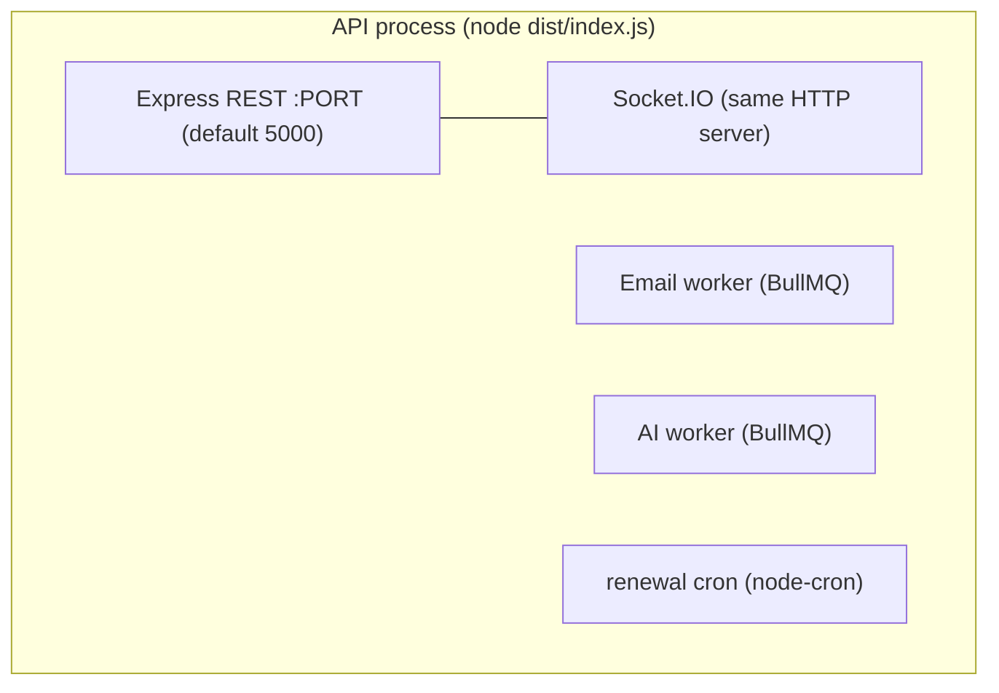
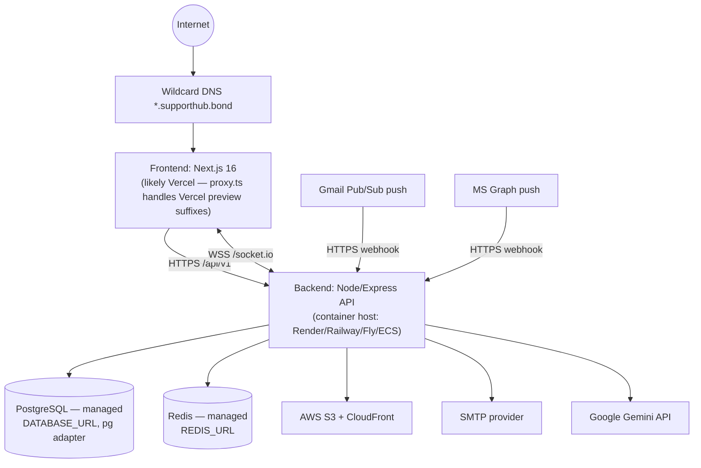
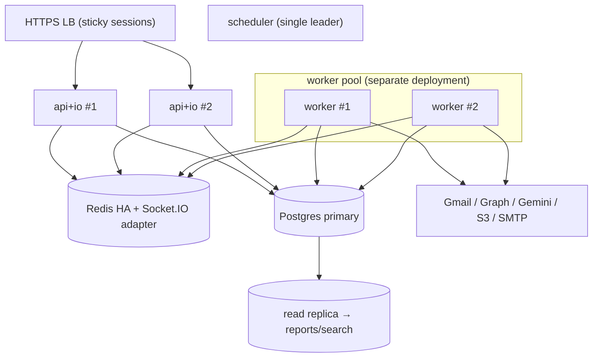

# Deployment Architecture

> Inferred from `package.json` scripts, `turbo.json`, `docker-compose.yml`, `scripts/start-docker.js`,
> the Prisma pg adapter, env‑var usage, and the frontend `proxy.ts` (Vercel‑aware). There are **no
> Dockerfiles or platform manifests** committed for the apps, so the production topology below is the
> most likely intended shape, clearly marked as inference.

## 1. Build & Tooling

- **Monorepo**: pnpm workspaces + **Turborepo** (`turbo build/lint/dev`). Tasks: `build` (API → `tsc`;
  web → `next build`), `dev` (persistent), `check-types`, `lint`.
- **API build**: `prisma generate` → `tsc` (ESM, `dist/`). Prod build caps heap (`--max-old-space-size=1536`).
- **Web build**: `next build` (Next.js 16, Turbopack in dev, port 3001).
- **DB**: Prisma migrations (`prisma migrate dev`, `db push`, `prisma studio`).
- **Local dev**: `pnpm dev` runs `scripts/start-docker.js` (boots Docker Desktop + `docker compose up -d`
  for Redis) then `turbo dev` (API + web together).

## 2. Runtime Processes

The API is **one Node process** that hosts five concerns simultaneously (`index.ts`):

The frontend is a separate **Next.js app** (port 3001).

## 3. Inferred Production Topology

Evidence for each box:
- **Frontend on Vercel** — `proxy.ts` explicitly handles Vercel preview deployment domains (`---`
  separator) and uses `NEXT_PUBLIC_*` envs; wildcard subdomain routing fits Vercel's host rewriting.
- **Backend container host** — long‑lived stateful process (sockets + workers + cron) needs an
  always‑on container, not serverless; heap‑capped prod build hints at a memory‑limited container.
- **Managed Postgres** — `@prisma/adapter-pg` + `DATABASE_URL`; the prisma lib comment references
  Accelerate‑style connection.
- **Managed Redis** — `REDIS_URL`; locally `redis:7-alpine` via compose.
- **S3 + CloudFront** — `AWS_*`, `CLOUDFRONT_DOMAIN` envs in `s3.service`.

## 4. Public Webhook Requirement

Gmail Pub/Sub and Graph subscriptions **push to a public HTTPS URL** (`APP_URL/api/v1/email/webhook/*`).
The setup docs reference **ngrok** for local development. In production the backend must be publicly
reachable at a stable HTTPS endpoint, and `APP_URL` must match what the subscriptions were registered
with.

## 5. Environment Separation

`NODE_ENV` gates behavior: dev exposes error `stack` + verbose messages and uses `http`/Ethereal SMTP;
prod hides internals and uses `https` for OAuth/verification redirects. `LOG_LEVEL` tunes pino.

### Key environment variables (from code scan)

| Group | Vars |
|-------|------|
| Core | `PORT`, `NODE_ENV`, `LOG_LEVEL`, `APP_URL`, `FRONTEND_URL`, `FRONTEND_DOMAIN` |
| Data | `DATABASE_URL`, `REDIS_URL` |
| Auth | `JWT_ACCESS_SECRET`, `JWT_REFRESH_SECRET`, `JWT_ACCESS_EXPIRY`, `JWT_REFRESH_EXPIRY`, `ENCRYPTION_KEY` |
| Gmail | `GOOGLE_CLIENT_ID/SECRET`, `GOOGLE_REDIRECT_URI`, `GOOGLE_PUBSUB_TOPIC` |
| Outlook | `MICROSOFT_CLIENT_ID/SECRET`, `MICROSOFT_REDIRECT_URI`, `MICROSOFT_TENANT_ID` |
| AI | `GEMINI_API_KEY` |
| Storage | `AWS_ACCESS_KEY_ID`, `AWS_SECRET_ACCESS_KEY`, `AWS_REGION`, `S3_BUCKET` (`process.env.S…`), `CLOUDFRONT_DOMAIN` |
| Email out | `SMTP_HOST/PORT/USER/PASS/FROM` |
| Frontend | `NEXT_PUBLIC_API_URL`, `NEXT_PUBLIC_SOCKET_URL`, `NEXT_PUBLIC_ROOT_DOMAIN` |

## 6. Deployment Concerns & Recommendations

| Concern | Detail | Recommendation |
|---------|--------|----------------|
| **No Dockerfiles/manifests committed** | Reproducible deploy is undefined | Add Dockerfiles for API + web, plus a manifest (compose/Helm/Render blueprint) |
| **Single API process = mixed workloads** | Web traffic, sockets, workers, cron share one runtime | Split into `web` (API+IO) and `worker` deployments from the same image; run cron as a single leader |
| **Cron duplication if scaled** | node-cron fires per instance | Leader election or BullMQ repeatable jobs |
| **Socket.IO not multi‑instance‑ready** | in‑memory rooms | Add `@socket.io/redis-adapter` + sticky sessions (Redis already present) |
| **Secrets via env only** | many high‑value secrets (`ENCRYPTION_KEY`, JWT secrets, OAuth) | Use a secrets manager; fail‑fast at boot if missing; rotate `ENCRYPTION_KEY` with key versioning |
| **`ENCRYPTION_KEY` rotation** | OAuth tokens are AES‑GCM with one key | Add key id prefix to ciphertext for rotation |
| **Stateful watches need stable `APP_URL`** | Renewal re‑registers against a public URL | Pin a stable domain; monitor `watchExpiry` |
| **No CI/CD / health‑based rollout shown** | — | Wire `GET /api/health` into readiness/liveness probes |

## 7. Suggested Target Topology (scaled)

</content>
