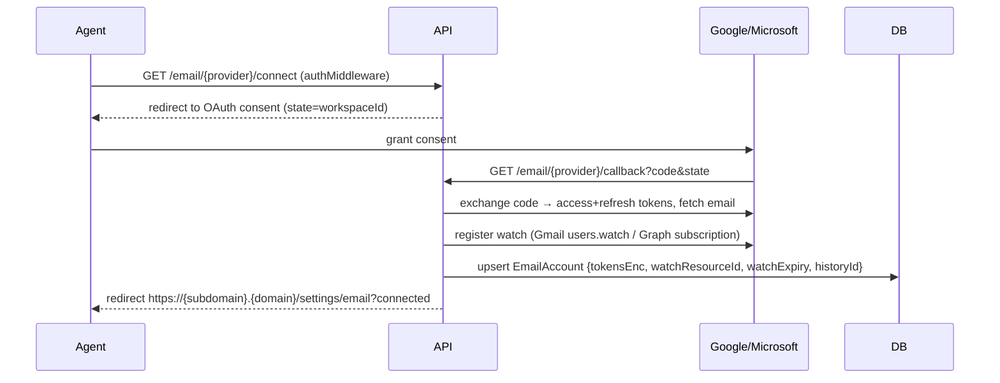
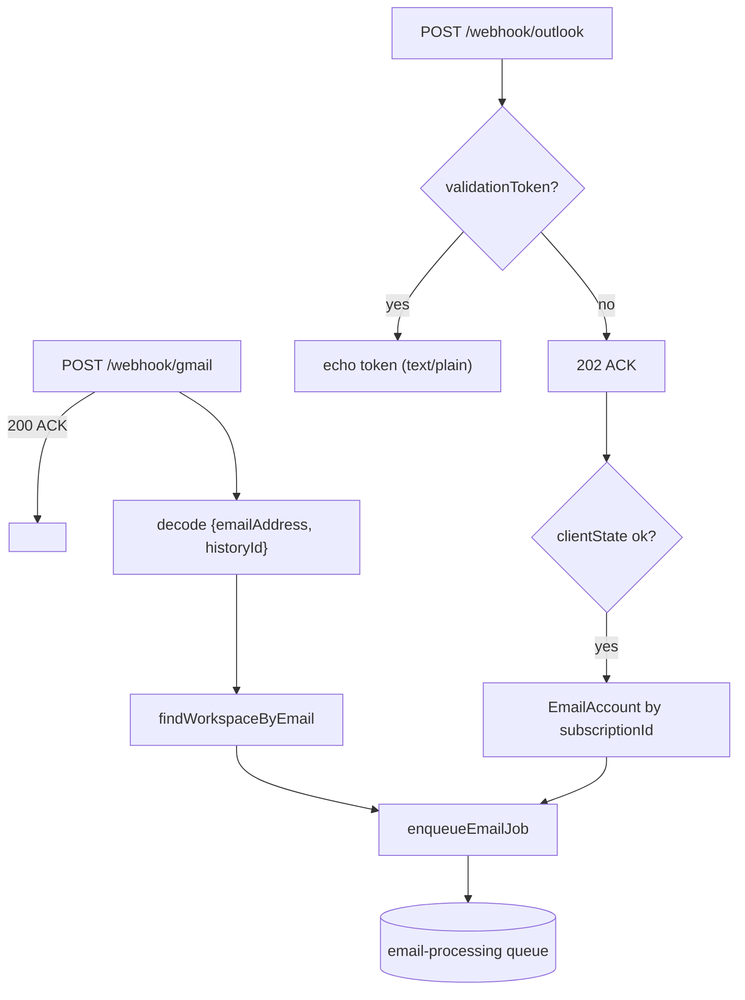
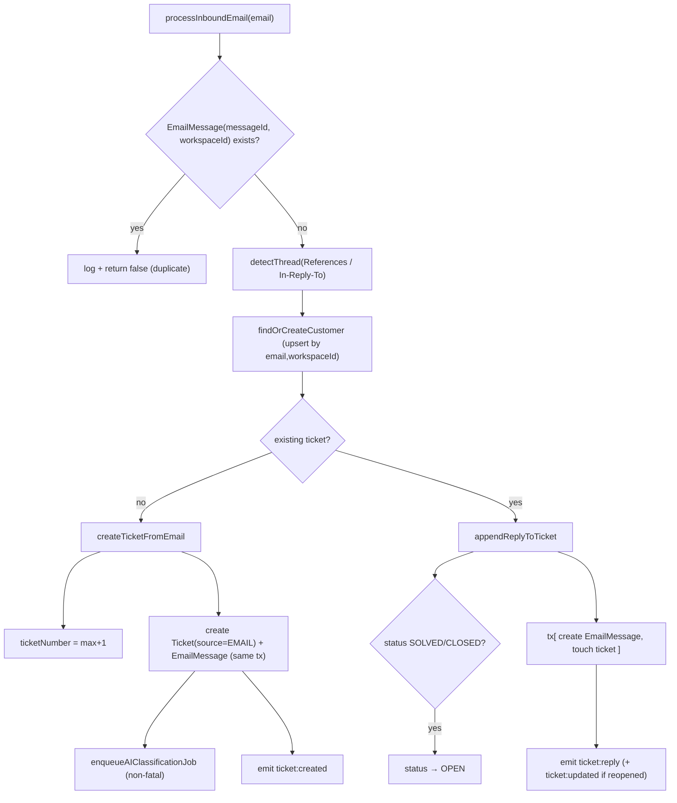
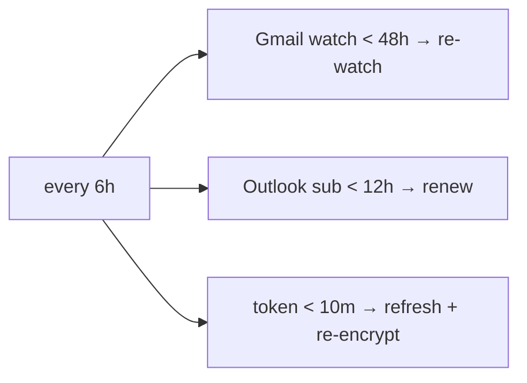

# Email‑to‑Ticket Architecture

The flagship subsystem. Converts inbound Gmail/Outlook email into deduplicated, threaded, AI‑classified,
auto‑assigned tickets. Modules: `modules/email/*`, `workers/email.worker.ts`,
`workers/ai-classification.worker.ts`, `services/{gemini,assignment-engine}.ts`, `cron/renewal.cron.ts`,
`lib/queue.ts`.

## 1. Overview

### Business problem
A shared support inbox (Gmail/Outlook) must become structured tickets **automatically and in
near‑real‑time**, without double‑answering, with replies stitched onto the right conversation, and
routed to the right agent.

### Design pillars
1. **Push, not poll** — Gmail Cloud Pub/Sub + Microsoft Graph subscriptions notify us on new mail.
2. **ACK fast, work later** — webhooks reply `200/202` immediately and enqueue to BullMQ; providers
   retry aggressively on slow responses, so processing must be off the request path.
3. **Two queues** — ingestion (`email-processing`) is isolated from AI (`ai-classification`) so Gemini
   latency never stalls ticket creation.
4. **Dedup at two layers** — BullMQ `jobId` + DB `@@unique([messageId, workspaceId])`.
5. **Encryption at rest** — OAuth tokens stored AES‑256‑GCM.

## 2. Providers & OAuth Connection

| | Gmail | Outlook |
|--|-------|---------|
| OAuth lib | `googleapis` OAuth2 | `@azure/msal-node` |
| Scopes | `gmail.readonly`, `userinfo.email` | `Mail.Read`, `offline_access` |
| State binding | `state = workspaceId` | `state = workspaceId` |
| Push mechanism | `users.watch` → Cloud Pub/Sub topic → push subscription | `POST /subscriptions` → webhook |
| Notification carries | `{ emailAddress, historyId }` (base64 in Pub/Sub envelope) | `{ subscriptionId, resourceData.id, clientState }` |
| Incremental sync | `historyId` cursor + `history.list` | none — message id is in the notification |
| Watch lifetime | 7 days | ≤3 days (code uses 2) |

### Connect flow (both providers, unified)



`@@unique([provider, workspaceId])` ⇒ exactly one Gmail and one Outlook per workspace; reconnect =
upsert.

### Token freshness
`getEmailAccountWithFreshTokens()` refreshes if the access token expires within **5 min**; the cron
also proactively refreshes tokens expiring within **10 min**. Gmail keeps its refresh token; Outlook may
rotate it (extracted from the MSAL cache).

## 3. Webhook Ingestion

### Routes (`email.routes.ts`)
| Route | Auth | Purpose |
|-------|------|---------|
| `GET /email/gmail/connect`, `/outlook/connect` | ✅ JWT | start OAuth |
| `GET /email/gmail/callback`, `/outlook/callback` | ❌ | OAuth redirect target |
| `GET /email/status` | ✅ JWT | connection status |
| `POST /email/disconnect/:provider` | ✅ JWT | disconnect |
| `POST /email/webhook/gmail` | ❌ | Pub/Sub push |
| `POST /email/webhook/outlook` | ❌ | Graph push (+validation handshake) |

### Webhook handlers (`webhook.controller.ts`)
- **Gmail**: ACK `200` **first**, then decode base64 Pub/Sub data → `{emailAddress, historyId}` →
  resolve `workspaceId` by email → `enqueueEmailJob`.
- **Outlook**: if `?validationToken` present, echo it as `text/plain` (subscription validation).
  Otherwise ACK `202`, verify `clientState === MICROSOFT_CLIENT_ID`, extract `messageId`, look up the
  `EmailAccount` by `watchResourceId == subscriptionId`, `enqueueEmailJob`.
- All processing errors are **logged, not thrown** (response already sent).



## 4. Queue → Worker → Processor

### `email-processing` queue (`lib/queue.ts`)
- `attempts: 3`, exponential backoff `5s/10s/20s`, `removeOnComplete:1000`, `removeOnFail:5000`.
- **Dedup jobId**: `` `${provider}-${accountEmail}-${historyId||messageId}` `` — identical webhooks
  collapse to one job.

### `email.worker.ts`
- `concurrency: 5`, limiter `20 jobs/min`. Routes by provider to `processGmailJob` / `processOutlookJob`.
- **Gmail**: `getEmailAccountWithFreshTokens` → `fetchNewMessageIds(historyId)` (incremental
  `history.list`, `messageAdded`, INBOX) → for each id `fetchGmailMessage` (full MIME parse) →
  `processInboundEmail`. Persists the latest `historyId` after the batch. Per‑message try/catch so one
  bad message doesn't fail the batch.
- **Outlook**: fetch the single message by id (`/me/messages/{id}`), or fall back to the 5 most recent
  inbox messages if the notification lacked an id.

### `processInboundEmail` (`email-processor.ts`) — the core state machine



## 5. Deduplication (how duplicate tickets are prevented)

Three independent guards:
1. **BullMQ `jobId`** — duplicate webhook deliveries dedupe at enqueue time.
2. **`EmailMessage @@unique([messageId, workspaceId])`** — the authoritative guard. Before doing
   anything, `processInboundEmail` checks for an existing `EmailMessage` with the same RFC‑2822
   `Message-ID`; if found, it logs and returns `false`.
3. **Per‑message defensive skip** — messages without a `Message-ID` header are skipped.

## 6. Thread Detection (how replies link to tickets)

`detectThread()` collects all referenced message‑ids from `In-Reply-To` + `References` (space‑split),
dedupes them, then:

```ts
prisma.emailMessage.findFirst({
  where: { workspaceId, messageId: { in: referencedIds } },
  select: { ticketId: true },
  orderBy: { createdAt: "desc" },   // most recent match wins
});
```

If a match is found → append as a reply to that ticket; else → new ticket. Every inbound mail (new or
reply) writes an `EmailMessage` row, so the **next** reply in the chain can be threaded. Replying to a
`SOLVED`/`CLOSED` ticket **reopens** it (`status → OPEN`) and emits `ticket:updated`.

## 7. AI Classification & Auto‑Assignment (downstream)

After a new ticket is created, `enqueueAIClassificationJob({ticketId, subject, bodyPlain, workspaceId})`
is pushed to the **`ai-classification`** queue (`jobId = classify-{ticketId}`; failure to enqueue is
non‑fatal — the ticket simply stays untagged).

### `ai-classification.worker.ts` (concurrency 3, limiter 15/min)

```mermaid
graph TD
    J["classify-ticket job"] --> G["gemini.service.classifyTicket(subject, body)"]
    G -->|null (no key / timeout / parse fail)| Log0["write empty AIDecisionLog, done"]
    G -->|result| Split["split tags by CONFIDENCE_THRESHOLD = 0.7"]
    Split --> Hi[">= 0.7 → connect Tag to Ticket"]
    Split --> Lo["< 0.7 → TagSuggestion (PENDING)"]
    Hi --> Pri["set priority = AI priority"]
    Pri --> RE["runAssignmentEngine(workspaceId, appliedTags)"]
    RE --> Asg{rule matched?}
    Asg -->|yes| Up["set assigneeId (+ setPriority override)"]
    Asg -->|no| Un["leave unassigned"]
    Up --> AL["write AIDecisionLog (raw, applied, suggested, ruleId, ms, model)"]
    Un --> AL
    AL --> EM["emit ticket:tagged (+ ticket:assigned)"]
```

### Gemini service (`services/gemini.service.ts`)
- Model **`gemini-2.0-flash`**, **15s timeout** (AbortController).
- Prompt injects the workspace's **controlled tag vocabulary** (the 5 `TagCategory` groups) and rules:
  ≥1 tag from ISSUE_TYPE & DEPARTMENT, ≤3 tags/category, confidence semantics, body capped at 3000
  chars.
- **Output is validated**: priority defaults to `MEDIUM` if invalid; **hallucinated tags are dropped**
  (must exist in `SYSTEM_TAGS`); confidence clamped to `[0,1]`. This prevents the model from inventing
  labels.
- Returns `null` on any failure → **graceful degradation** (ticket created, just untagged).

### Confidence thresholding
- **≥ 0.70** → tag is **auto‑applied** (`tags.connect`).
- **< 0.70** → inserted as a **`TagSuggestion (PENDING)`** for human review.
- Agents review via `GET /tickets/:id/suggestions` and
  `PATCH /tickets/:id/suggestions/:suggestionId {action: accept|reject}` — accept connects the tag in a
  **transaction** that's idempotent (only flips `PENDING`).

### Assignment engine (`services/assignment-engine.ts`)
- Loads `AssignmentRule` where `isEnabled`, **ordered by `priority asc`**, **first match wins**.
- `conditions = { operator: "AND"|"OR", conditions: [{category, tagName}] }` evaluated against the
  ticket's applied tags (case‑insensitive name match).
- Strategy: `SPECIFIC` → `rule.assigneeId`; `ROUND_ROBIN` → `findLeastLoadedAgent` (the agent with the
  fewest `OPEN`/`PENDING` assigned tickets; ties broken by array order — *not* a true rotation).
- Side effects returned: `setPriority` (overrides AI priority) and `flagUrgent` (**returned but not yet
  applied** to the ticket — a known no‑op).

### Audit: `AIDecisionLog`
Every run writes an immutable log: `rawResponse`, `tagsApplied`, `tagsSuggested`, `prioritySet`,
`ruleId`, `ruleName` (snapshot), `assigneeId`, `processingMs`, `modelVersion`. Admin‑only endpoints
(`/ai-logs`) page through them.

## 8. Watch / Subscription Renewal (`cron/renewal.cron.ts`)

`node-cron` schedule **`0 */6 * * *`** (every 6h):
- **Gmail watch**: re‑register `users.watch` for accounts whose `watchExpiry` is within **48h**; update
  `watchExpiry` + `historyId`.
- **Outlook subscription**: `PATCH /subscriptions/{id}` to extend for accounts within **12h** of expiry.
- **Token refresh**: refresh any account whose access token expires within **10 min**.



## 9. Attachments

`services/s3.service.ts` exists and is used by **workspace branding** (logo/favicon) uploads. The
inbound‑email processor **does not currently extract or store attachments** — bodies (`html || plain`)
become the ticket description, but file attachments aren't persisted. This is a known gap to call out.

## 10. Real‑time emissions from this subsystem

| Event | Emitted by | Payload |
|-------|-----------|---------|
| `ticket:created` | email‑processor (new ticket) | ticket summary + customer |
| `ticket:reply` | email‑processor (reply) | `{ticketId, reply, reopened}` |
| `ticket:updated` | email‑processor (reopen) | `{ticketId, changes:{status:OPEN}}` |
| `ticket:tagged` | AI worker | `{ticketId, tags, suggestions, priority}` |
| `ticket:assigned` | AI worker | `{ticketId, assigneeId, ruleName}` |

See [websocket-architecture.md](./websocket-architecture.md).

## 11. Failure & Retry Behavior

| Stage | Failure | Behavior |
|-------|---------|----------|
| Webhook | any | ACK already sent; error logged; provider may re‑push |
| Enqueue | Redis down | logged; Gmail recoverable via persisted `historyId`; Outlook not backfilled |
| Email job | exception | re‑thrown → BullMQ retry (3×, 5/10/20s) |
| Single message | parse/fetch error | logged, skipped, batch continues |
| AI enqueue | error | non‑fatal; ticket stays untagged |
| Gemini | null/timeout | ticket created untagged; `AIDecisionLog` still written; **no retry** (valid outcome) |
| AI job DB error | exception | re‑thrown → BullMQ retry (3×, 3/6/12s) |

## 12. Known Gaps / Improvements

- **`ticketNumber` race** (max+1 not atomic) can collide under concurrent inbound mail → use a Postgres
  sequence or transaction+retry.
- **No attachment ingestion** despite S3 service availability.
- **`flagUrgent` is a no‑op** in the worker.
- **Round‑robin isn't a true rotation** (least‑loaded with array‑order tie‑break; no persisted pointer).
- **Outlook lacks incremental backfill** — missed notifications during downtime aren't recovered the way
  Gmail's `historyId` allows.
- **Manual ticket API operations don't emit socket events** (only the email/AI path does) — dashboards
  rely on React Query refetch for manual changes.
</content>
