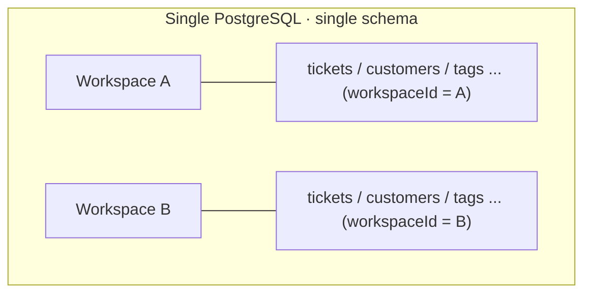
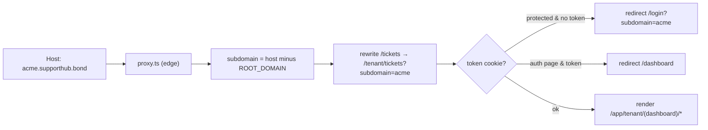
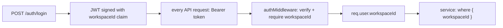

# Multi‑Tenant Architecture

This is the architectural backbone of SupportHub and the most important section for system‑design
interviews.

## 1. Tenancy Model (the verdict)

| Dimension | Choice |
|-----------|--------|
| Database | **Shared database** (one PostgreSQL) |
| Schema | **Shared schema** (one set of tables) |
| Isolation discriminator | **`workspaceId` column** on every tenant‑owned table |
| Tenant aggregate root | `Workspace` (one row per registered company) |
| Tenant addressing | **Subdomain** (`acme.supporthub.bond`) |
| Tenant context propagation | **`workspaceId` claim inside the JWT** (and the socket handshake) |
| Isolation enforcement | **Application layer** (`where: { workspaceId }` + id re‑checks). No DB RLS. |

This is the classic **pooled / shared‑everything** SaaS model — cheapest to operate, highest density,
at the cost of relying on disciplined query scoping for isolation.



## 2. Tenant Resolution (two independent paths)

There are **two** resolution mechanisms — one for the **frontend (routing/UX)** and one for the
**backend (data authority)**.

### (a) Frontend: subdomain → tenant route (`apps/web/src/proxy.ts`)



- Parses the `Host` header, strips `NEXT_PUBLIC_ROOT_DOMAIN`, handles Vercel preview `---` suffixes.
- Root‑domain requests (marketing site, global `/login`, `/register`) pass through unchanged.
- Subdomain requests are **rewritten** into the `/tenant/*` route group and the subdomain is carried as
  a query param for the tenant layouts.
- This is **routing/branding only** — it determines which workspace's *login screen and theme* you see.
  It is **not** a security boundary.

### (b) Backend: JWT → `workspaceId` (the real boundary)



The **authoritative** tenant is the `workspaceId` baked into the JWT at login. The client cannot
change it (it's signed), and the API never trusts a subdomain/header to pick the tenant for data
access. This cleanly decouples *which subdomain you typed* from *which data you can read*.

## 3. Workspace Access Flow (end‑to‑end)

```mermaid
sequenceDiagram
    participant B as Browser (acme.supporthub.bond)
    participant Proxy as Next proxy.ts
    participant API
    participant DB

    B->>Proxy: GET /tickets
    Proxy->>Proxy: subdomain=acme; has token cookie?
    Proxy-->>B: render /tenant/tickets (theme=acme)
    B->>API: GET /api/v1/tickets (Bearer JWT, workspaceId=acme-id)
    API->>API: authMiddleware → req.user.workspaceId
    API->>DB: findMany where workspaceId = acme-id
    DB-->>API: only Acme tickets
    API-->>B: tickets
    Note over API,DB: A token for workspace B can never read A's rows —<br/>the workspaceId comes from the signed token, not the URL.
```

## 4. How Tenant Boundaries Are Enforced (concretely)

| Operation type | Mechanism | Example |
|----------------|-----------|---------|
| **Create** | `workspaceId` injected from `req.user`, never from body | `createTicket(data, req.user.workspaceId)` |
| **List/aggregate** | `where: { workspaceId }` baked into query | tickets list, reports, search, suggestions |
| **Read/update/delete by id** | fetch then assert `record.workspaceId === req.user.workspaceId` → 404 | `getTicket`, `updateTicket`, `deleteTicket`, `addComment`, `getSuggestions` |
| **Cross‑references** (tags, assignees) | resolved **within** the workspace only | `tag.findMany({ where:{ workspaceId, name:{in} } })` — a tag id from another tenant simply won't be found |
| **Inbound email** | webhook resolves the `EmailAccount` → its `workspaceId`; everything downstream uses it | `findWorkspaceByEmail`, account lookup by `subscriptionId` |
| **Real‑time** | socket force‑joins `workspace:{workspaceId}`; emits target that room only | `emitTicketEvent(workspaceId, …)` |
| **Uniqueness** | composite keys scoped by workspace | `@@unique([email, workspaceId])`, `@@unique([ticketNumber, workspaceId])`, `@@unique([messageId, workspaceId])` |

### Data‑leakage prevention highlights
- **404 over 403** on cross‑tenant id access — doesn't confirm a record exists in another tenant.
- **Customer email uniqueness is per‑workspace**, so the same person emailing two SupportHub customers
  produces two isolated `Customer` rows.
- **Email dedup is per‑workspace** (`@@unique([messageId, workspaceId])`) — comment in
  `email-processor` notes different workspaces can legitimately receive copies of the same message.
- **Socket rooms** guarantee no cross‑tenant event delivery even though one Socket.IO server serves all
  tenants.

## 5. Subdomain Architecture

- Subdomain is generated at registration (`generateSubdomain(company)` → lowercase alphanumeric, ≤63
  chars) and stored as the **globally‑unique** `Workspace.subdomain`.
- DNS is expected to be **wildcard** (`*.supporthub.bond`) so every workspace resolves to the same
  frontend deployment; `proxy.ts` does host‑based rewriting.
- Backend redirects (OAuth callbacks, email verification) reconstruct the tenant URL as
  `{protocol}://{subdomain}.{FRONTEND_DOMAIN}/...`.

## 6. Strengths

- **Operational simplicity & density** — one DB, one schema, one deploy serves all tenants.
- **Tenant context is free** — no per‑request tenant lookup; it rides in the JWT.
- **Defense‑in‑depth** — scoped queries *and* id re‑checks.
- **Clean separation** of routing‑tenant (subdomain) vs security‑tenant (JWT claim).

## 7. Risks & Scaling Concerns

| Risk | Why | Mitigation |
|------|-----|------------|
| **Isolation depends on every query being scoped** | One forgotten `where: { workspaceId }` = cross‑tenant leak | Add **Postgres RLS** as a backstop; a `prisma` extension/middleware that auto‑injects `workspaceId`; lint/test for unscoped queries |
| **Noisy‑neighbor** | A high‑volume tenant's tickets/queries share the same DB and queues | Per‑tenant rate limits; queue priorities; eventually shard by `workspaceId` |
| **No per‑tenant encryption / data residency** | All tenants in one DB | For enterprise: schema‑per‑tenant or DB‑per‑tenant tier |
| **Global uniques can collide across tenants** | `User.email` is global → same person can't be a user in two workspaces (invitation explicitly blocks this) | Acceptable, but limits agents working for multiple companies; would need a `Membership` join model |
| **Subdomain is immutable‑ish** | Derived from company name, unique | Add rename/alias support with redirects |
| **Hard to "lift out" a tenant** | Pooled data | Export tooling keyed by `workspaceId`; partitioning |

## 8. Evolution Path

```
Today: shared DB + shared schema + workspaceId (pooled)
  → add Postgres RLS + auto-scoped Prisma client (safety)
  → add read replica + per-tenant rate limiting (scale)
  → "siloed tier": schema-per-tenant or DB-per-tenant for enterprise customers (compliance)
  → shard pooled tenants by workspaceId hash (massive scale)
```
</content>
