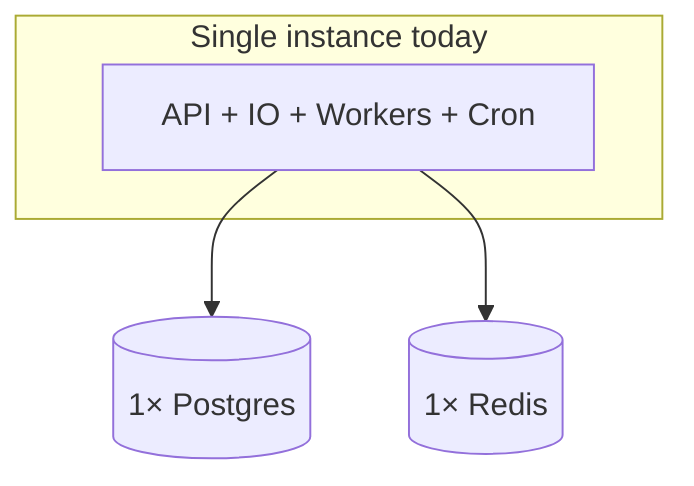
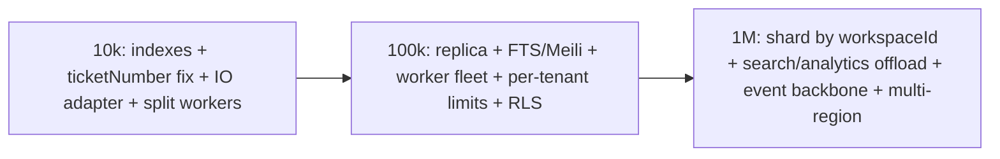
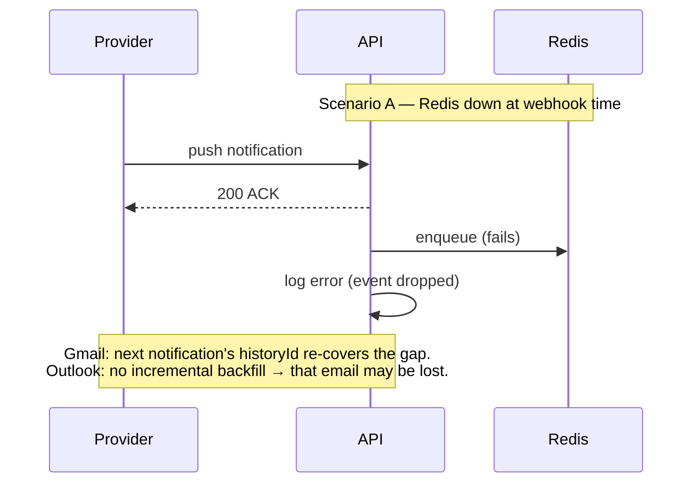

# Scalability & Failure Analysis

This document covers per‑subsystem bottlenecks, the 10k → 100k → 1M user scaling path, failure modes,
and the two smaller subsystems (search, notifications) in their scaling context.

## 1. Current Architecture Reality Check

Everything runs in **one Node process** (API + Socket.IO + 2 BullMQ workers + cron) against **one
Postgres** and **one Redis**. This is a **modular monolith** — excellent for shipping fast and for a
single‑instance deployment, but several components hold **in‑process state** (Socket.IO rooms, cron)
that must change before horizontal scaling.



## 2. Per‑Subsystem Bottlenecks & Scaling Strategy

### 2.1 HTTP API (Express)
- **Bottleneck**: stateless and CPU‑light, but shares the event loop with workers/sockets.
- **Horizontal scaling**: ✅ ready — JWT is stateless, no server session. Run N instances behind a LB.
- **Action**: separate the worker process so HTTP latency isn't affected by Gemini/email work.

### 2.2 PostgreSQL (the primary scaling constraint)
- **Bottlenecks**:
  - **Missing composite indexes** on hot paths (`Ticket(workspaceId,status,updatedAt)`,
    `(workspaceId,assigneeId)`, `(workspaceId,createdAt)`).
  - **`ticketNumber` race** — `MAX+1` read‑then‑insert is not atomic (collision under concurrency).
  - **Reports aggregate in JS** (pull rows → reduce) instead of SQL.
  - **Search is `ILIKE %term%`** — unindexable full scan.
- **Scaling path**: indexes → read replica for reports/search → partition large append‑only tables
  (`EmailMessage`, `AIDecisionLog`) → shard pooled tenants by `workspaceId`.

### 2.3 Redis + BullMQ
- **Bottleneck**: single Redis = SPOF for the entire async plane; global (not per‑tenant) rate limits.
- **Scaling**: Redis HA (Sentinel/Cluster); move workers to a dedicated pool; per‑tenant queues/priorities.

### 2.4 Socket.IO
- **Bottleneck**: **in‑memory rooms, single process** — emits don't cross instances; workers emit
  in‑process.
- **Scaling**: `@socket.io/redis-adapter` + sticky sessions (Redis already present). See
  [websocket-architecture.md](./websocket-architecture.md).

### 2.5 Email ingestion (workers + provider APIs)
- **Bottleneck**: provider API quotas; cron renewal duplicated if multi‑instance; Outlook has no
  incremental backfill.
- **Scaling**: dedicated worker fleet; per‑tenant concurrency; single leader cron; monitor `watchExpiry`.

### 2.6 AI classification (Gemini)
- **Bottleneck**: external latency + 15/min global rate limit; cost scales linearly with ticket volume.
- **Scaling**: per‑tenant quotas, batching, caching identical content, cheaper model tiers, and a
  fallback path (already graceful: `null` ⇒ untagged).

### 2.7 Search subsystem
- **Today**: Prisma `contains, mode:insensitive` over `subject`/`description` (+ exact `ticketNumber`
  parse), `take` ≤20, ordered by `updatedAt`. No ranking, no FTS, no index.
- **Scaling path**: Postgres FTS (`tsvector` + GIN) or `pg_trgm` for fuzzy → dedicated engine
  (Meilisearch/Elasticsearch) with per‑workspace indexes for relevance + typo tolerance + filters.

### 2.8 Notification subsystem
- **Today**: notifications are **transient/real‑time only** — Socket.IO events drive React Query
  invalidation + toasts (e.g. new email ticket, reopened). There is **no persisted notification model**,
  no unread counts, no digest emails.
- **Scaling path**: add a `Notification` table (per user, read/unread), deliver via the socket room +
  a fallback email/digest worker; this also enables offline catch‑up.

## 3. The 10k / 100k / 1M Question

### → 10,000 users (small/mid SaaS)
The current design **largely works** with two fixes:
1. Add the missing **composite indexes** + fix **`ticketNumber`** atomicity.
2. Add the **Socket.IO Redis adapter** and **split workers** into their own process so you can run 2–3
   API instances behind a LB with sticky sessions.

Single beefy Postgres + managed Redis is fine. Reports/search acceptable.

### → 100,000 users
- **DB**: read replica for reports/search; move reporting to SQL aggregations or nightly rollups;
  introduce **Postgres FTS** or Meilisearch for search.
- **Workers**: dedicated autoscaled worker fleet; **per‑tenant rate limits** on email + Gemini; single
  leader cron (or BullMQ repeatable jobs).
- **Redis**: HA cluster.
- **Tenancy**: add **Postgres RLS** as a leak backstop; per‑tenant noisy‑neighbor controls.
- **Realtime**: dedicated realtime tier with Redis adapter; selective rooms.

### → 1,000,000 users
- **Shard Postgres by `workspaceId`** (pooled tenants across shards; large tenants get dedicated
  shards/DBs — the "siloed tier").
- **Search/analytics off the OLTP path**: Elasticsearch + a columnar/warehouse store (ClickHouse/BigQuery)
  fed by CDC; reporting served from there.
- **Event backbone**: introduce Kafka/streams between ingestion → classification → projections; treat
  `AIDecisionLog`/`EmailMessage` as event streams with partitioning + archival.
- **Realtime**: horizontally‑sharded gateway; regionalization.
- **Multi‑region** for data residency + latency; per‑tenant encryption keys.



## 4. Failure Analysis (per subsystem)

| Subsystem | Single point of failure | Data‑consistency risk | Recovery / retry |
|-----------|------------------------|-----------------------|------------------|
| API process | Yes — one process hosts everything | — | `uncaughtException` exits → orchestrator restart |
| Postgres | Yes (single instance) | `ticketNumber` race → duplicate‑number insert fails (P2002) | Prisma error mapping; **needs** transaction/sequence |
| Redis | Yes | Lost enqueue if down at webhook time | Gmail recoverable via `historyId`; Outlook not |
| Socket.IO | In‑memory state | Missed events on disconnect | Refetch‑on‑event self‑heals UI |
| Email worker | Shares process | Re‑process safe (dedup constraints) | BullMQ 3× backoff; per‑message skip |
| AI worker | Shares process | Re‑classify bounded by `classify-{ticketId}` | Gemini null = no retry (logged); DB error = retry |
| Cron | In‑process, duplicates if scaled | Double renewal (idempotent‑ish) | per‑account try/catch |
| External APIs | Provider outages | Tokens/watches may lapse | token + watch renewal cron; graceful degradation |

### Representative failure scenarios



```mermaid
sequenceDiagram
    participant E1 as Email A
    participant E2 as Email B
    participant DB
    Note over E1,DB: Scenario B — ticketNumber race
    E1->>DB: read MAX(ticketNumber)=5
    E2->>DB: read MAX(ticketNumber)=5
    E1->>DB: insert #6 (ok)
    E2->>DB: insert #6 → P2002 unique violation
    Note over E2,DB: BullMQ retries the job; on retry MAX=6 → inserts #7. Self-corrects, but wastes a retry and can gap numbers.
```

## 5. Consolidated Top Improvements (ranked by leverage)

1. **Composite indexes** on `Ticket` hot paths + **atomic `ticketNumber`** (sequence/transaction).
2. **Split workers** into their own deployment; **single leader cron** (or BullMQ repeatable jobs).
3. **Socket.IO Redis adapter** + sticky sessions (cheap — Redis already there).
4. **Postgres RLS** as a tenant‑leak backstop; auto‑scoped Prisma client.
5. **Real search** (Postgres FTS first, then Meilisearch/Elastic).
6. **Move reporting to SQL aggregations / rollups**; add a **read replica**.
7. **Per‑tenant rate limits** (email + Gemini) for noisy‑neighbor control.
8. **Persisted notifications** + **attachment ingestion** + wire **invitation emails** (currently a
   `console.log` TODO) + apply **`flagUrgent`** (currently a no‑op).
9. **Observability**: Bull Board + failed‑job alerts; fail‑fast on missing secrets; metrics/tracing.
</content>
