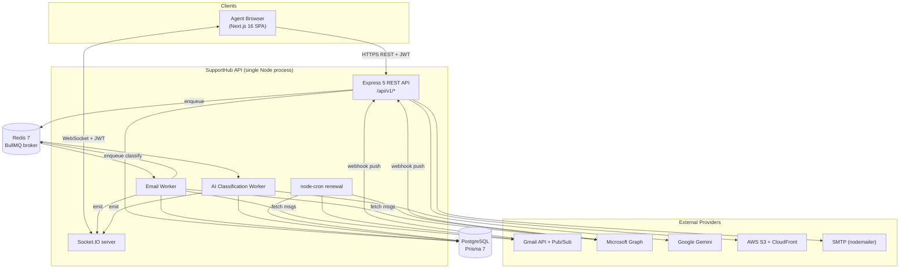
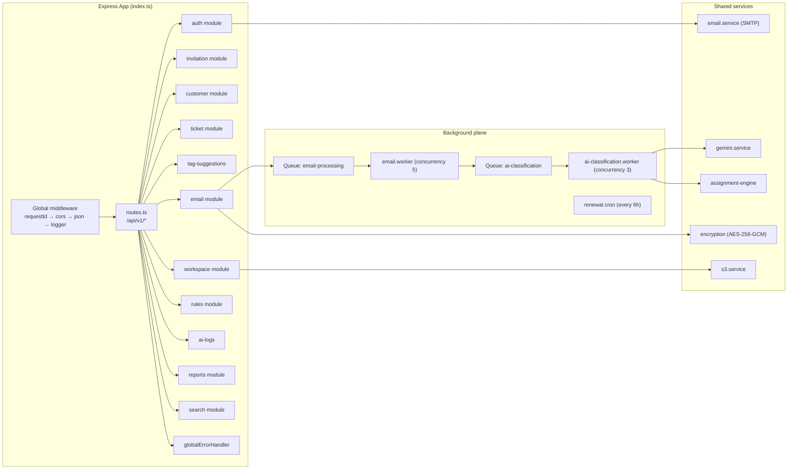
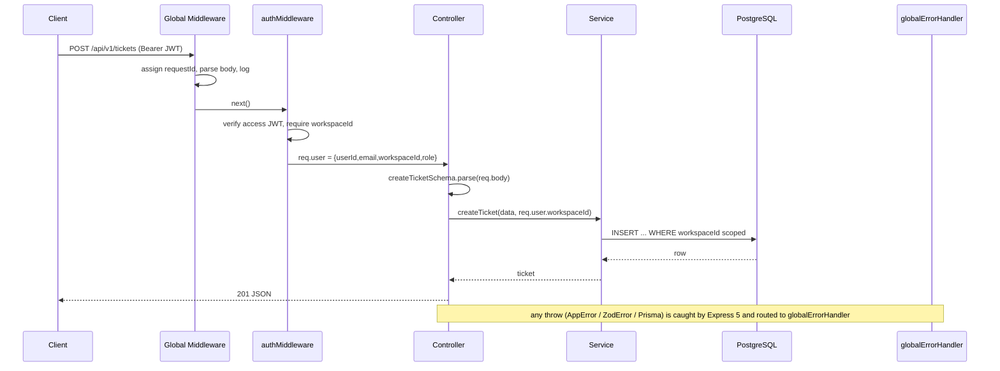
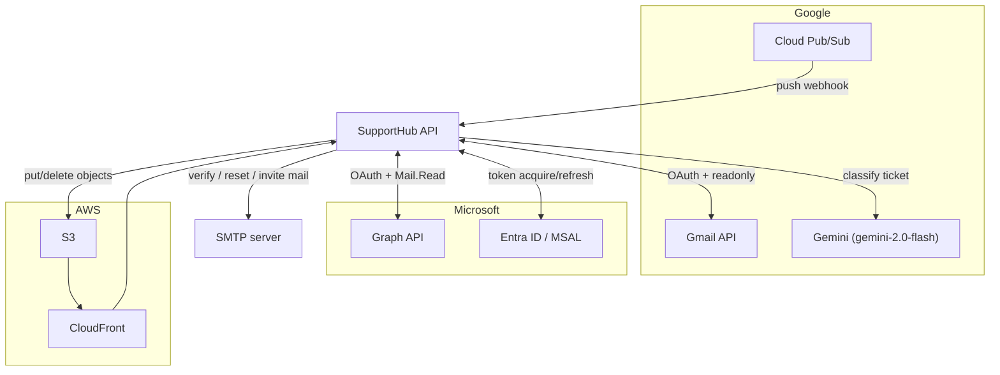
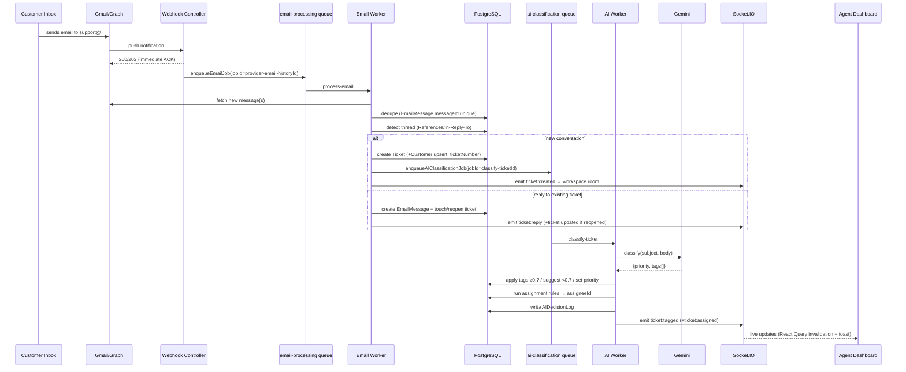

# System Architecture

## 1. Architecture Overview

### Purpose & Business Problem

SupportHub solves the **"shared inbox doesn't scale"** problem for support teams. Small/mid companies
start by handling support@company.com in a personal Gmail/Outlook inbox; this breaks down: no
ownership, no SLA tracking, no analytics, replies get lost, the same email gets answered twice.

SupportHub converts that inbox into a structured, multi‑agent helpdesk: every inbound email becomes a
deduplicated, threaded **ticket**, automatically **classified by AI** (tags + priority) and
**auto‑assigned** to the right agent, with a **real‑time** dashboard and per‑company **white‑label
branding** — all isolated per **tenant (workspace)**.

### Core Responsibilities

1. **Identity & tenancy** — registration creates a workspace; dual‑token JWT auth; RBAC.
2. **Email ingestion** — OAuth‑connect Gmail/Outlook, receive push notifications, fetch messages.
3. **Ticketing** — create/thread/dedupe tickets, comments (public/internal), status lifecycle.
4. **AI automation** — Gemini classification + tag suggestions + rule‑based assignment.
5. **Real‑time** — push ticket events to workspace‑scoped Socket.IO rooms.
6. **Analytics & search** — reporting aggregations, substring search.
7. **Branding** — per‑workspace theme + asset storage on S3/CloudFront.

### Why this architecture was chosen

| Decision | Rationale (as evidenced in code) |
|----------|-----------------------------------|
| **Modular monolith** (Express, feature modules) | One deployable API process; modules (`auth`, `ticket`, `email`…) keep clear boundaries (`*.routes/controller/service/validation`) without microservice overhead. |
| **BullMQ queues decoupled from HTTP** | Webhooks must ACK in <1s (Google/Microsoft retry aggressively). Heavy work (Gmail fetch, Gemini call) runs async so ingestion is never blocked. `lib/queue.ts:1‑10` explicitly states this. |
| **Two separate queues** (`email-processing`, `ai-classification`) | "email ingestion is never blocked by Gemini latency, and AI jobs can have independent retry/rate‑limit settings" — `lib/queue.ts:6‑9`. |
| **Shared DB / shared schema, `workspaceId` column** | Cheapest multi‑tenant model to operate; every table carries `workspaceId`. See [multi-tenant-architecture.md](./multi-tenant-architecture.md). |
| **Stateless JWT auth** | Horizontally scalable API; `workspaceId` embedded in token = tenant context travels with every request and every socket handshake. |
| **Push (webhook) over polling** | Near‑real‑time ingestion at low quota cost vs. periodic IMAP polling. |

---

## 2. Architecture Diagrams

### High‑Level System Architecture



### Component‑Level Architecture



---

## 3. API Architecture

### Structure & conventions

The API is a **layered modular monolith**. Every feature module follows the same shape:

```
modules/<feature>/
  <feature>.routes.ts       # Express Router; binds middleware + controller
  <feature>.controller.ts   # parse req → call service → res.json (thin)
  <feature>.service.ts      # business logic + Prisma (workspace-scoped)
  <feature>.validation.ts   # Zod schemas
  <feature>.types.ts        # z.infer types
```

All modules are mounted under `/api/v1/*` from a single registry (`routes.ts`):

```
/api/v1/auth         /api/v1/invitations   /api/v1/customers
/api/v1/tickets      /api/v1/email         /api/v1/workspace
/api/v1/rules        /api/v1/ai-logs       /api/v1/reports     /api/v1/search
```

Health probes live outside the registry: `GET /` and `GET /api/health` (`index.ts:62‑68`).

### Middleware layers (order matters)

From `index.ts:44‑77`:

```mermaid
graph LR
    Req[Request] --> RID["requestIdMiddleware<br/>(X-Request-Id, UUID)"]
    RID --> CORS["cors()"]
    CORS --> JSON["express.json / urlencoded"]
    JSON --> LOG["pino access logger (res.on finish)"]
    LOG --> ROUTE["/api router"]
    ROUTE --> AUTHMW["authMiddleware (per protected route)"]
    AUTHMW --> ADMINMW["adminOnly (admin routes)"]
    ADMINMW --> VAL["Zod schema.parse in controller"]
    VAL --> CTRL["controller → service"]
    CTRL --> NF["notFoundHandler (404)"]
    NF --> ERR["globalErrorHandler (last)"]
```



### Request lifecycle (authenticated, validated mutation)



### Validation strategy

- **Zod at the edge of the controller**: `schema.parse(req.body | req.query)` throws `ZodError` on
  failure. Types are derived via `z.infer` so the schema is the single source of truth.
- Example complexity differences: registration password is `min(8)` only, but **reset‑password
  enforces** upper+lower+digit+special via regex (`auth.validation.ts`). Worth noting as an
  inconsistency (see interview‑prep weaknesses).

### Error handling

`errors/error-handler.middleware.ts` is the **last** middleware and normalizes everything into:

```json
{ "status":"error", "code":"<MACHINE_CODE>", "message":"...", "details":[...], "requestId":"..." }
```

| Thrown type | Mapped to |
|-------------|-----------|
| `AppError` (factory methods: `badRequest/unauthorized/forbidden/notFound/conflict/rateLimited/internal`) | its own `statusCode` + `code` |
| `ZodError` | 400 `VALIDATION_ERROR` with field‑level `details` |
| Prisma `P2002` | 409 `CONFLICT` (unique violation) |
| Prisma `P2025` | 404 `NOT_FOUND` |
| Prisma `P2003/P2014` | 400 `BAD_REQUEST` (FK / relation) |
| anything else | 500 `INTERNAL_ERROR` (message hidden in prod) |

Express 5 auto‑forwards rejected async handlers, so controllers don't need try/catch. Every response
carries `requestId` for log correlation. Prisma is duck‑typed (`code.startsWith("P")`) to avoid a hard
import in the error module.

---

## 4. External Integrations



| Integration | Purpose | Data flow | Failure handling | Retry |
|-------------|---------|-----------|------------------|-------|
| **Gmail API + Pub/Sub** | Inbound email → tickets | `users.watch` registers push to Pub/Sub topic; webhook decodes `{emailAddress, historyId}`; worker calls `history.list` (incremental) then `messages.get` | Webhook always ACKs 200 first; per‑message try/catch; bad historyId logged | BullMQ 3 attempts, exp backoff 5/10/20s |
| **Microsoft Graph + MSAL** | Inbound email → tickets | Graph `POST /subscriptions` → webhook with `subscriptionId` + `resourceData.id`; worker `GET /me/messages/{id}` | Validation handshake echoes `validationToken`; `clientState` checked; ACK 202 first | BullMQ 3 attempts |
| **Google Gemini** | Tag/priority classification | Worker builds constrained prompt (system‑tag vocabulary) → JSON response validated, hallucinated tags dropped, 15s timeout | Returns `null` ⇒ ticket created untagged (graceful degradation); logs decision anyway | 3 attempts (DB errors only; null is a valid outcome) |
| **AWS S3 + CloudFront** | Workspace logos/favicons | Multer memory buffer → `uploadFile` → CloudFront URL stored on `WorkspaceTheme` | Old asset delete failure logged, non‑fatal | none (single attempt) |
| **SMTP (nodemailer)** | Verification, reset, (invite TODO) | Service sends transactional mail; dev uses Ethereal | Registration verify mail is **fire‑and‑forget** (logged); resend/reset are **email‑first** (DB only updated if send succeeds) | none |
| **Redis** | BullMQ broker + job store | `ioredis` singleton, `maxRetriesPerRequest:null` (BullMQ requirement) | connection errors logged; `unhandledRejection` caught | ioredis auto‑reconnect |

> ⚠️ **Code note:** Invitation email is still a `console.log` simulation in
> `invitation.service.ts` (`TODO: Actually send the email`). The transactional SMTP service exists but
> isn't wired into invitations yet.

---

## 5. End‑to‑End: "Customer emails support" (the flagship flow)



This single flow exercises **8 subsystems** — webhooks, queues, workers, DB, AI, rules engine,
audit logging, and real‑time. It is the best 2‑minute whiteboard story for an interview (see
[interview-prep.md](./interview-prep.md)).

---

## 6. Failure Analysis (system‑wide)

| Failure | Blast radius | Mitigation in code | Gap |
|---------|--------------|--------------------|-----|
| API process crash | All HTTP + sockets + workers + cron die together (single process) | `uncaughtException` exits(1) to let orchestrator restart | No clustering; workers not isolated from web |
| Redis down | No new jobs processed; webhooks still ACK but enqueue fails | webhook catches + logs; ticket lost until provider re‑pushes (Gmail historyId persists) | No DLQ/alerting |
| Postgres down | All requests 500 | Prisma errors mapped; pg adapter pool | Single DB instance assumed |
| Gemini down/timeout | Ticket created untagged/unassigned | returns `null`, logs `AIDecisionLog` | Ticket sits in unassigned view |
| Provider webhook missed | Email never ingested | Gmail recovers via next historyId; cron re‑arms watch | Outlook has no incremental backfill |
| Duplicate webhook | Could double‑process | BullMQ `jobId` dedup **and** `EmailMessage` unique constraint | — |

See [scalability-analysis.md](./scalability-analysis.md) for the per‑subsystem deep dive and the
10k/100k/1M user analysis.
</content>
