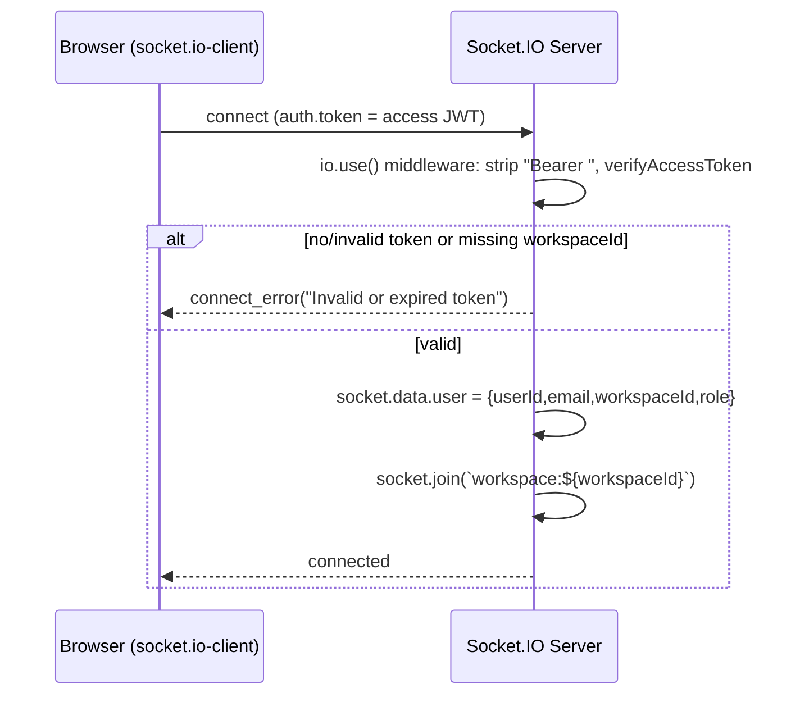
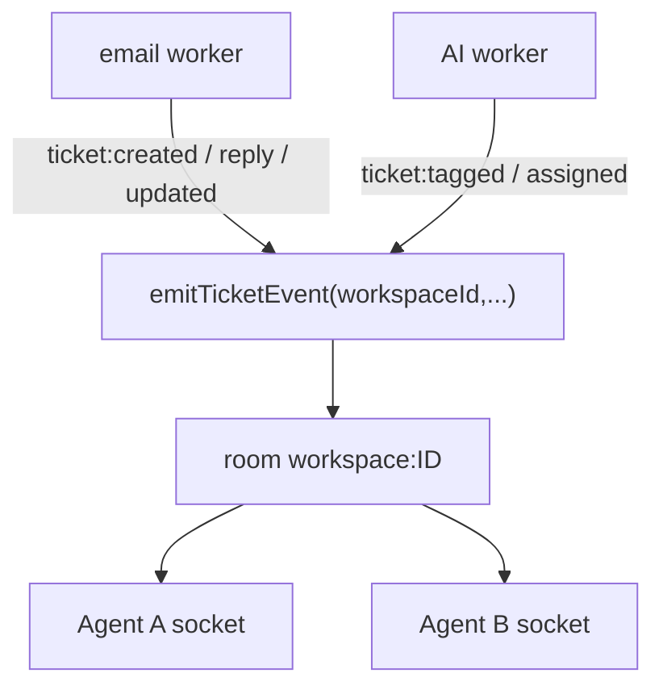
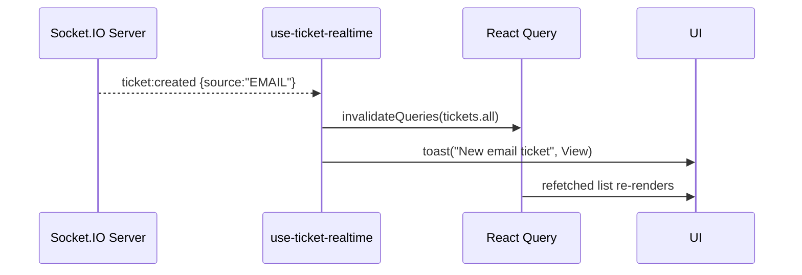
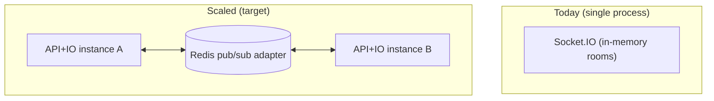

# Real‑Time / WebSocket Architecture

Source: `apps/api/src/lib/socket.ts`, emitters across `email-processor.ts` and
`ai-classification.worker.ts`; frontend `apps/web/src/lib/socket.ts` + `hooks/use-ticket-realtime.ts`.

## 1. Overview

SupportHub uses **Socket.IO 4** attached to the same HTTP server as the Express API
(`http.createServer(app)` then `initSocketIO(server)` in `index.ts`). Real‑time exists so agents see
**new email tickets, replies, AI tags, and assignments appear live** without polling.

```
Client (Socket.IO) ↔ Socket.IO Server (JWT handshake) ↔ workspace room ↔ emitters (email/AI workers)
                                                                              ↕
                                                                          PostgreSQL
```

## 2. Connection & Authentication



- The **same access JWT** authenticates the socket (handshake `auth.token` or `Authorization` header).
- Token must contain `workspaceId` or the handshake is rejected.
- On connect the socket **auto‑joins exactly one room: `workspace:{workspaceId}`** — this is the
  multi‑tenant isolation boundary for real‑time.
- CORS origin = `FRONTEND_URL`; path `/socket.io`.

## 3. Room Structure & Event Flow

- **One room per workspace** (`workspace:{id}`). No per‑user, per‑ticket, or per‑role rooms.
- Emission is always `io.to(`workspace:${workspaceId}`).emit(event, data)` via the
  `emitTicketEvent(workspaceId, event, data)` helper → **all agents of a tenant** receive the event;
  **no other tenant** can.



### Event catalog
| Event | Source | Payload shape |
|-------|--------|---------------|
| `ticket:created` | email‑processor | `{ ticket: {id, ticketNumber, subject, status, priority, source, customer, createdAt} }` |
| `ticket:reply` | email‑processor | `{ ticketId, reply:{body, source, customerId, createdAt}, reopened }` |
| `ticket:updated` | email‑processor | `{ ticketId, changes }` |
| `ticket:tagged` | AI worker | `{ ticketId, tags, suggestions, priority }` |
| `ticket:assigned` | AI worker | `{ ticketId, assigneeId, ruleName }` |

## 4. Frontend Consumption

- `lib/socket.ts` — lazy **singleton** client; `auth:{token}`; transports `["websocket","polling"]`;
  reconnection 10 attempts, 1s→10s backoff.
- `hooks/use-ticket-realtime.ts` — subscribes to `ticket:created/updated/reply` and on each event calls
  `queryClient.invalidateQueries(queryKeys.tickets.all)` (React Query refetch) plus toasts
  (e.g. "New email ticket", "Ticket reopened" with a link). Mounted once in the dashboard `AuthGuard`,
  so it's app‑wide for authenticated users.



> Note: the frontend hook subscribes to `created/updated/reply`; `ticket:tagged`/`ticket:assigned` are
> emitted by the backend but (per the reviewed hook) primarily drive list invalidation through the same
> path — tags/assignee show up on the next refetch.

## 5. Presence & Reconnection

- **Presence**: only basic connect/disconnect logging (`socket.id`, `userId`, `workspaceId`). There is
  **no presence model** (no "agent online" indicators, no typing, no read receipts).
- **Reconnection**: handled by the client's Socket.IO reconnection settings. On reconnect the socket
  re‑authenticates and re‑joins its room. **Missed events during a disconnect are not replayed** — but
  because every handler triggers a React Query refetch, the UI **self‑heals** to current DB state on the
  next event or window action. There is no event log / cursor for guaranteed delivery.

## 6. Scaling Limitations (important for interviews)

The Socket.IO server keeps **rooms and socket state in the memory of a single Node process**. This is
the key constraint:

| Limitation | Consequence | Fix |
|------------|-------------|-----|
| **In‑memory rooms, single process** | Horizontal scaling breaks: a socket on instance A won't receive `emitTicketEvent` fired on instance B | Add the **`@socket.io/redis-adapter`** (or redis‑streams adapter) so emits fan out across instances via Redis pub/sub (Redis is already present) |
| **Sticky sessions needed** | The polling transport fallback requires session affinity behind a load balancer | Enable sticky sessions / consistent hashing at the LB |
| **Emitters call `getIO()` in‑process** | Workers emit through the same process's `io`; in a multi‑process deploy a worker on a different host can't reach connected sockets | Emit via the Redis adapter, or publish events to Redis and have the gateway process relay |
| **No backpressure / fan‑out limits** | A workspace with thousands of connected agents = large per‑event fan‑out | Namespacing, selective rooms, or a dedicated realtime tier |
| **No guaranteed delivery** | Events lost during disconnect aren't replayed | Acceptable given refetch‑on‑event; for stronger guarantees add an event cursor/outbox |



Because **Redis is already in the stack** (for BullMQ), adding the Socket.IO Redis adapter is the
single highest‑leverage change to make real‑time horizontally scalable.

## 7. Strengths

- **Clean tenant isolation** via per‑workspace rooms + JWT handshake.
- **Reuses the access token** — no separate socket auth scheme.
- **Self‑healing UI** — events drive cache invalidation rather than carrying authoritative state, so
  transient loss is tolerable.
- **Decoupled emitters** — `emitTicketEvent` is called from workers without coupling business logic to
  socket internals (and it no‑ops safely if `io` isn't initialized).
</content>
